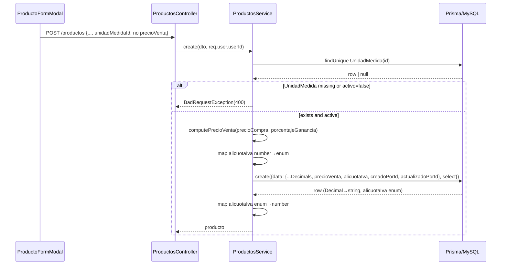

# Design: Productos CRUD (Create, List, Update)

## Technical Approach

Clone the shipped `unidades-medida` backend module and `unidades-medida` frontend route as the CRUD shell, rename to `Producto`/`productos`, then extend for the richer field set: `Decimal` money/quantity fields, the server-side `precioVenta` compute step, the `alicuotaIva` enum, and a **required** `unidadMedida` FK with a service existence pre-check. The frontend adds a copied-and-slimmed searchable select for Unidad de Medida. All patterns already exist in the codebase — this change only introduces the four new primitives (money/`Decimal`, computed field, VAT enum, required cross-catalog FK) cleanly so they set the convention.

## Architecture Decisions

### Decision: `alicuotaIva` — Prisma native enum with `@map`, numeric API codec

**Choice**: Prisma `enum AlicuotaIva { IVA_21 @map("21") IVA_10_5 @map("10.5") }` (MySQL `ENUM('21','10.5')`). The DTO validates a **number** (`@IsIn([21, 10.5])`); the service translates number ↔ enum member via a small bidirectional codec, and the response serializes back to the number.
**Alternatives considered**: (a) Plain `Decimal`/`Float` column with only DTO-level `@IsIn([21,10.5])`. (b) Raw enum member names as the API contract (`'IVA_21'`).
**Rationale**: D4 is final — the value set is closed and must be DB-enforced, so an open decimal column (a) is rejected: it lets bad rows exist if a future writer bypasses the DTO. `@map("21")`/`@map("10.5")` keeps the raw DB values clean for reporting while the Prisma identifier stays legal (`10.5` is not a valid identifier). The numeric codec (rejecting b) keeps the API and the `<select>` ergonomic — the client never learns the enum member names.

### Decision: Money/quantity precision handled as `Prisma.Decimal`, never JS float

**Choice**: All money/quantity columns use `@db.Decimal(p,s)`. The service does ALL arithmetic with `Prisma.Decimal` (decimal.js) methods and rounds explicitly before storing. DTO money/quantity inputs are numbers validated with `@IsNumber({ maxDecimalPlaces: 2 })`; they are wrapped in `new Prisma.Decimal(...)` immediately. Response/TS types expose these fields as **`string`** (Prisma serializes `Decimal` to string).
**Alternatives considered**: JS-number arithmetic on the compute step; accepting money as raw floats through to Prisma.
**Rationale**: This is the first `Decimal` precedent — `precioCompra * (1 + pct/100)` in JS floats accumulates rounding error (e.g. `0.1+0.2`). `Prisma.Decimal` is exact; explicit `ROUND_HALF_UP` to scale 2 makes the stored `precioVenta` deterministic and matches what the API returns.

### Decision: `precioVenta` computed server-side on create AND update (D1)

**Choice**: `precioVenta` is absent from both write DTOs. A single private `computePrecioVenta(precioCompra, porcentajeGanancia)` service method runs on every create and update and writes the stored column.
**Rationale**: D1 — derived + stored (denormalized). Centralizing in one method guarantees create/update can never drift and the client can never inject a value.

### Decision: `unidadMedidaId` existence + active pre-check → 400 (create + update)

**Choice**: Before create/update, the service calls `prisma.unidadMedida.findUnique({ where: { id } })`; if absent OR `activo === false`, it throws `BadRequestException` (400 — the request body carries an invalid/unusable reference). The DB FK remains the atomic backstop for existence. **User-confirmed: a `Producto` MUST NOT reference an inactive `UnidadMedida`** — this applies to both create and update.
**Alternatives considered**: 404; relying on the FK error alone; existence-only (no active check).
**Rationale**: A missing OR deactivated reference is bad input to a create/update, so 400 is more accurate than 404, and an explicit pre-check yields a clean domain message (e.g. "La unidad de medida no existe o está inactiva.") instead of a raw Prisma `P2003`. Since the update DTO carries `unidadMedidaId` on every `PATCH` (mirroring the sibling repeat-fields approach), this check re-runs on every update, not just when the UM is being changed — so if a `Producto`'s current `UnidadMedida` is deactivated after creation, that product cannot be saved again until its `unidadMedidaId` is switched to an active unit (or the original unit is reactivated). This is an intentional consequence of "MUST NOT reference an inactive UnidadMedida," not a bug — flagged here so `sdd-tasks`/QA don't mistake it for one.

### Decision: Defer inline Unidad-de-Medida quick-create (resolves proposal Open Item)

**Choice**: Ship only a searchable select. Copy `vehiculos/SearchableSelect.tsx` into `productos/UnidadMedidaSelect.tsx` **without** the quick-create footer, `QuickCreateModal`, or `create` prop.
**Alternatives considered**: Reuse the shared component and make `create`/`quickCreate` optional (modifies shipped `vehiculos/` code); ship the full quick-create affordance now.
**Rationale**: The proposal leans defer. A copy (the proposal says "mirroring") leaves shipped `vehiculos/` untouched, keeps this first slice inside the review budget, and UM creation is a rare setup task already covered by the `/unidades-medida` page. Inline creation is a clean follow-up.

## Data Flow

    ProductoFormModal ──POST/PATCH──▶ ProductosController ──▶ ProductosService
       (no precioVenta)                  (JwtAuthGuard,           │ 1. validate unidadMedidaId exists (→400)
       UnidadMedidaSelect                 req.user.userId)        │ 2. computePrecioVenta() [Prisma.Decimal]
        └─search─▶ GET /unidades-medida                          │ 3. stamp audit FKs
                                                                 ▼
    page.tsx ◀──list (Decimal→string)──── Prisma ◀── create/update(data, select)

## Prisma Schema (additions to `server/prisma/schema.prisma`)

```prisma
enum AlicuotaIva {
  IVA_21   @map("21")
  IVA_10_5 @map("10.5")
}

model Producto {
  id                 Int      @id @default(autoincrement())
  descripcion        String   @unique
  unidadMedidaId     Int
  unidadMedida       UnidadMedida @relation(fields: [unidadMedidaId], references: [id])
  activo             Boolean  @default(true)
  cantidadInicial    Decimal  @db.Decimal(10, 2)
  alertaStock        Boolean  @default(false)
  cantidadMinima     Decimal  @db.Decimal(10, 2)
  precioCompra       Decimal  @db.Decimal(10, 2)
  porcentajeGanancia Decimal  @db.Decimal(5, 2)
  precioVenta        Decimal  @db.Decimal(10, 2)   // derived, server-computed
  precioMayorista    Decimal  @db.Decimal(10, 2)   // A1: independently editable
  alicuotaIva        AlicuotaIva
  creadoPorId        Int?
  creadoPor          User?    @relation("ProductoCreadoPor", fields: [creadoPorId], references: [id], onDelete: SetNull)
  actualizadoPorId   Int?
  actualizadoPor     User?    @relation("ProductoActualizadoPor", fields: [actualizadoPorId], references: [id], onDelete: SetNull)
  createdAt          DateTime @default(now())
  updatedAt          DateTime @updatedAt
}
```

Back-relations to add: `UnidadMedida.productos Producto[]`; `User.productosCreados Producto[] @relation("ProductoCreadoPor")` and `User.productosActualizados Producto[] @relation("ProductoActualizadoPor")`. One additive migration (new table + enum + FKs).

## precioVenta compute mechanics

Single service method, called by both `create` and `update`, never trusting client input:

```ts
import { Prisma } from '@prisma/client';

private computePrecioVenta(precioCompra: number, porcentajeGanancia: number): Prisma.Decimal {
  const base = new Prisma.Decimal(precioCompra);
  const factor = new Prisma.Decimal(porcentajeGanancia).div(100).plus(1);
  return base.mul(factor).toDecimalPlaces(2, Prisma.Decimal.ROUND_HALF_UP);
}
```

`alicuotaIva` codec (service): `const IVA_TO_ENUM = { 21: 'IVA_21', 10.5: 'IVA_10_5' } as const;` and its inverse for the SELECT mapping. The `PRODUCTO_SELECT` includes `unidadMedida: { select: { id: true, descripcion: true } }` plus the two audit-user selects (mirroring `UNIDAD_MEDIDA_SELECT`).

## Sequence — POST /productos (create)



## Sequence — PATCH /:id (update)

```mermaid
sequenceDiagram
  participant Ctl as ProductosController
  participant Svc as ProductosService
  participant DB as Prisma/MySQL
  Ctl->>Svc: update(id, dto, req.user.userId)
  Svc->>DB: findUnique Producto(id)
  DB-->>Svc: row | null (null→404)
  Svc->>DB: findUnique UnidadMedida(unidadMedidaId)
  DB-->>Svc: row | null (null or activo=false→400)
  Svc->>Svc: recompute precioVenta; stamp actualizadoPorId only
  Svc->>DB: update({data, select})
  DB-->>Svc: row
```

Duplicate `descripcion` → 409 on both paths, reusing the sibling `isDescripcionConflict` pre-check + P2002 backstop pattern verbatim.

## File Changes

| File | Action | Description |
|------|--------|-------------|
| `server/prisma/schema.prisma` | Modify | `Producto` model + `AlicuotaIva` enum + 3 back-relations |
| `server/prisma/migrations/*` | Create | One additive migration (table + enum + FKs) |
| `server/src/productos/productos.controller.ts` | Create | Thin controller, `JwtAuthGuard`, `@Request()` on POST+PATCH |
| `server/src/productos/productos.service.ts` | Create | CRUD + `computePrecioVenta` + UM existence check + IVA codec |
| `server/src/productos/dto/{create,update,list-query}-producto.dto.ts` | Create | Validation; `precioVenta` absent; `alicuotaIva` `@IsIn([21,10.5])` |
| `server/src/productos/productos.module.ts` | Create | Module wiring |
| `server/src/app.module.ts` | Modify | Register `ProductosModule` |
| `client/app/(dashboard)/productos/page.tsx` | Create | List + filters + pagination (no export) |
| `client/app/(dashboard)/productos/ProductoFormModal.tsx` | Create | Create/edit; `activo` edit-only; `precioVenta` read-only auto |
| `client/app/(dashboard)/productos/UnidadMedidaSelect.tsx` | Create | Copied+slimmed SearchableSelect (no quick-create) |
| `client/app/lib/productos.ts` | Create | Typed client; Decimal fields typed as `string` |
| `client/app/lib/navigation.tsx` | Modify | One flat "Productos" entry (placeholder icon) |

## Interfaces / Contracts

- `CreateProductoDto`: `descripcion`, `unidadMedidaId:number`, `cantidadInicial:number`, `alertaStock?:boolean`, `cantidadMinima:number`, `precioCompra:number`, `porcentajeGanancia:number`, `precioMayorista:number`, `alicuotaIva:number @IsIn([21,10.5])`. **No `precioVenta`, no `activo`.**
- `UpdateProductoDto`: same fields + `activo?:boolean` (mirrors sibling repeat-fields approach).
- `ListProductosQueryDto`: `page`, `pageSize`, `search`, `status` — identical to `ListUnidadesMedidaQueryDto`.
- API response money/quantity fields (`precioCompra`, `precioVenta`, `precioMayorista`, `porcentajeGanancia`, `cantidadInicial`, `cantidadMinima`) are **strings**; `alicuotaIva` is a **number** (`21`|`10.5`).

## Testing Strategy

No test runner configured (`strict_tdd: false`). Verification is manual + `npm run build`.

| Layer | What to Test | Approach |
|-------|-------------|----------|
| Build | Prisma generate + Nest + Next compile | `npm run build` both workspaces |
| Manual | precioVenta recompute on create/update; 400 on bad or inactive `unidadMedidaId`; 409 dup; IVA rejects other values; `precioVenta`/audit never client-set | Bearer-token requests + UI walkthrough |

## Migration / Rollout

One additive migration (new table + enum + FKs). Reversible per proposal Rollback Plan — drop `Producto` and `AlicuotaIva` before touching `UnidadMedida`. Confirm `DATABASE_URL` before migrating. No backfill.

## Resolved Questions

- **Inactive `UnidadMedida` reference**: user-confirmed REJECTED — create/update require the referenced `UnidadMedida` to exist AND be `activo: true` (see "Decision: `unidadMedidaId` existence + active pre-check" above).
- **Quantity scale**: user-confirmed `Decimal(10,2)` is sufficient — no change from A4.
