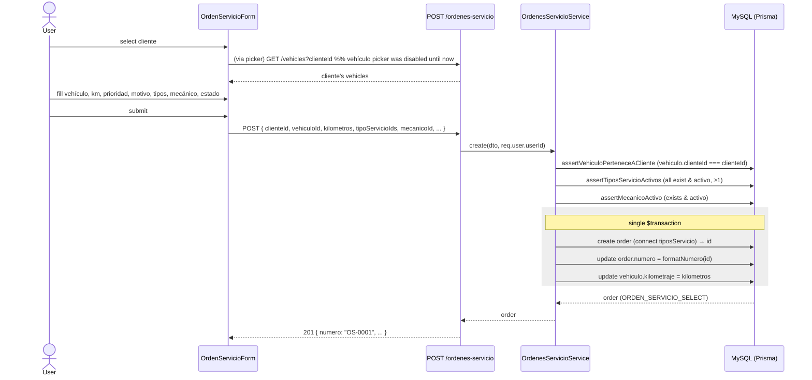

# Design: Orden de Servicio (Work Order intake)

## Technical Approach

Add a NestJS `ordenes-servicio` module structurally modeled on `etiquetas/` (thin controller, service owns all Prisma, `class-validator` whitelist DTOs, `SELECT` whitelist constant, Nest built-in exceptions, Spanish messages), with the many-to-many wiring copied from Producto↔Etiqueta. One additive Prisma migration adds the `OrdenServicio` model plus the `Estado`/`Prioridad` enums and the `_OrdenServicioToTipoServicio` join table. Two shared list endpoints (`GET /vehicles`, `GET /users`) gain optional query params. Frontend follows the productos dedicated create/edit pages pattern with a shared form, reusing `SearchableSelect` and a copied `TipoServicioMultiSelect`. All endpoints are `JwtAuthGuard`-only (no role guard — deferred to Permisos, per D14).

The three operational side effects — deriving `numero`, syncing the vehicle odometer, and connecting `tiposServicio` — all run inside a single interactive Prisma `$transaction` on both create and update, so an order and its derived/linked state never drift on a partial failure.

## Data Model

### Enums (`server/prisma/schema.prisma`)

Unlike `AlicuotaIva` (schema.prisma:133-137), whose raw values `'21'`/`'10.5'` are **not** legal Prisma enum identifiers and therefore need `@map` + a number/enum codec, our enum values are already legal identifiers that match the desired DB/API strings. No `@map` and **no codec** (no `IVA_TO_ENUM`-style mapping) are needed — the DTO `@IsIn([...])` value equals the stored value equals the API value.

```prisma
enum Prioridad {
  normal
  alta
  urgente
}

enum Estado {
  pendiente
  en_proceso
  terminado
}
```

### `OrdenServicio` model

```prisma
model OrdenServicio {
  id               Int            @id @default(autoincrement())
  numero           String?        @unique
  fechaIngreso     DateTime       @default(now())
  kilometros       Int
  prioridad        Prioridad      @default(normal)
  motivoIngreso    String         @db.Text
  estado           Estado         @default(pendiente)
  clienteId        Int
  cliente          Cliente        @relation(fields: [clienteId], references: [id])
  vehiculoId       Int
  vehiculo         Vehiculo       @relation(fields: [vehiculoId], references: [id])
  mecanicoId       Int
  mecanico         User           @relation("OrdenServicioMecanico", fields: [mecanicoId], references: [id])
  tiposServicio    TipoServicio[]
  creadoPorId      Int?
  creadoPor        User?          @relation("OrdenServicioCreadoPor", fields: [creadoPorId], references: [id], onDelete: SetNull)
  actualizadoPorId Int?
  actualizadoPor   User?          @relation("OrdenServicioActualizadoPor", fields: [actualizadoPorId], references: [id], onDelete: SetNull)
  createdAt        DateTime       @default(now())
  updatedAt        DateTime       @updatedAt
}
```

Back-relations to add:

```prisma
// User (three, alongside the existing *Creados/*Actualizados arrays):
ordenesServicioAsignadas    OrdenServicio[] @relation("OrdenServicioMecanico")
ordenesServicioCreadas      OrdenServicio[] @relation("OrdenServicioCreadoPor")
ordenesServicioActualizadas OrdenServicio[] @relation("OrdenServicioActualizadoPor")

// Cliente:      ordenesServicio OrdenServicio[]
// Vehiculo:     ordenesServicio OrdenServicio[]
// TipoServicio: ordenesServicio OrdenServicio[]
```

The `mecanico` relation is a **required** FK to `User` with the default `Restrict` on delete (mirrors `Vehiculo.marca`/`Vehiculo.cliente`, which specify no `onDelete`), while the two audit FKs are nullable `SetNull` (the `Cliente` dual-audit shape). `tiposServicio TipoServicio[]` + the `ordenesServicio OrdenServicio[]` back-relation is an implicit m2m — Prisma generates `_OrdenServicioToTipoServicio`, exactly like `_EtiquetaToProducto`. Migration is additive-only; `sdd-apply` MUST confirm `DATABASE_URL` before running `prisma migrate`.

## Architecture Decisions

### DD1 — `numero` generation: derive from `id`, persisted inside the create transaction (resolves proposal D3 + top Risk)

**Choice**: `numero = 'OS-' + String(id).padStart(4, '0')`, computed **on write** the moment Prisma's `create` returns the auto-generated `id`, then written back with a second `update` **inside the same transaction** that already performs the odometer sync. `numero` is declared `String? @unique`.

**Alternatives considered**:

| Option | Mechanism | Verdict |
|--------|-----------|---------|
| A — dedicated counter/sequence table | `OrdenServicioSequence` row incremented in-txn + `@unique` backstop | **Rejected** — introduces infrastructure with zero precedent in this codebase; needs row-locking to be race-safe; solves a problem the PK already solves. |
| B (chosen) — derive from `id` | Ride MySQL `auto_increment`; format on write; persist in the existing txn | **Chosen.** |
| B′ — derive on read only | Never store `numero`; compute in the result mapper | Rejected as the primary — a valid, even simpler variant, but a stored column is directly searchable/filterable (`contains` on `numero`) and immutable if the format later diverges from `id`. |
| C — MySQL sequence emulation | DB-level sequence object | **Rejected** — MySQL has no native sequences; emulation reduces to Option A. |

**Rationale**: `id` is generated atomically by MySQL's own `auto_increment` — two concurrent creates receive distinct ids, so their derived `numero`s are distinct by construction. **There is no counter to race and no max+1 read.** It needs zero new infrastructure. The `@unique` on `numero` is a pure backstop that can only fire on a programming error, never on concurrency. `padStart(4)` yields `OS-0001…OS-9999` and then naturally `OS-10000+` (monotonic preserved, only zero-padding is bounded). The one consequence: because `id` is unknown at INSERT time and the column is `NOT NULL`-incompatible with a two-step write, `numero` is nullable **at the column level only** — it is always populated before the transaction commits, so no committed row is ever `NULL` and no external reader observes a null (transaction isolation). We persist (rather than derive-on-read) because the list search/filter matches `numero` directly and the value survives a hypothetical future format change. Persisting is effectively free: the odometer-sync transaction already exists, so the write-back is one extra statement on a transaction we were opening anyway.

`formatNumero(id: number)` is a module-level pure helper; `numero` is **never** regenerated on update (immutable once set).

### DD2 — All three side effects in one interactive `$transaction`

**Choice**: `create`/`update` use `this.prisma.$transaction(async (tx) => { … })` wrapping: (1) the order write, (2) the `numero` back-fill (create only), and (3) `tx.vehiculo.update({ data: { kilometraje } })`. **Alternatives**: array-form `$transaction([...])` (cannot thread the generated `id` between statements). **Rationale**: the odometer sync and the `numero` back-fill both depend on the just-created `id`, requiring the interactive callback form. One transaction satisfies the proposal's "same transaction" requirement (D5) and the partial-failure risk in one stroke.

### DD3 — Reuse `SearchableSelect` for all three single pickers; make `quickCreate` optional (resolves the frontend open question)

**Choice**: Do **not** fork a new dependent-select component. Lightly extend `SearchableSelect.tsx` to make the `quickCreate` prop **optional** — render the "+ Crear" footer and `QuickCreateModal` only when it is provided. Then:
- **Cliente** picker → `SearchableSelect` + `clienteSelectConfig` **verbatim** (already has quick-create).
- **Mecánico** picker → `SearchableSelect` with a new `mecanicoSelectConfig` (search only, **no** `quickCreate`).
- **Vehículo** picker → `SearchableSelect` with `disabled={clienteId === ''}` and a `search` closure that captures `clienteId` (`(term) => listVehicles({ clienteId, search: term })`), **no** `quickCreate`.

**Alternatives**: a bespoke `VehiculoDependentSelect.tsx` (the proposal floated this). **Rationale**: `SearchableSelect` **already** supports everything the dependent picker needs — a `disabled` prop and a `search` callback that can close over `clienteId`; and it **already** resets its displayed label when the controlled `value` becomes `''` (the `useEffect(() => { if (value === '') setSelectedLabel(null) }, [value])`). So "reset vehículo when cliente changes" is achieved purely by the parent setting `vehiculoId = ''` on cliente change — no new component. The **only** blocker to reuse is the hardcoded quick-create footer (a vehículo/user quick-create is nonsensical here), which the optional-prop extension removes. This is backward compatible: every existing caller (marca/color/cliente in the vehículos form) passes `quickCreate`, so their behavior is unchanged.

### DD4 — `tiposServicio` requires ≥1; guard mirrors `assertEtiquetasActivas` with a min-1 twist

**Choice**: `assertTiposServicioActivos(ids)` copies `assertEtiquetasActivas` (findMany by `id in`, reject on count-mismatch or any `!activo`) but additionally **rejects an empty array** (`BadRequestException`), and the DTO enforces `@ArrayMinSize(1)`. **Rationale**: the proposal's Success Criteria require ≥1 tipo de servicio; `etiquetas` allow zero, so this is the one deliberate divergence from the copied guard.

### DD5 — `JwtAuthGuard` only, no role guard (D14)

**Choice**: class-level `@UseGuards(JwtAuthGuard)`, no `RolesGuard`. **Rationale**: consistent with every existing section; access control deferred to Permisos. `mecanicoId` accepts **any active** `User` (D6), not only `rol === 'mecanico'`.

## Backend Module Structure

`server/src/ordenes-servicio/` mirrors `etiquetas/`:

| File | Contents |
|------|----------|
| `ordenes-servicio.module.ts` | `@Module({ controllers: [OrdenesServicioController], providers: [OrdenesServicioService] })` → `OrdenesServicioModule` |
| `ordenes-servicio.controller.ts` | `@Controller('ordenes-servicio')` + class-level `@UseGuards(JwtAuthGuard)`; routes `GET /`, `GET /:id`, `POST /`, `PATCH /:id` (no `export`, no `DELETE`). `POST`/`PATCH` inject `@Request()` and pass `req.user.userId`. |
| `ordenes-servicio.service.ts` | `findAll`, `findOne`, `create`, `update`; owns all Prisma + the `$transaction` |
| `dto/create-orden-servicio.dto.ts` | `CreateOrdenServicioDto` |
| `dto/update-orden-servicio.dto.ts` | `UpdateOrdenServicioDto` (same field set repeated, house pattern — no `PartialType`) |
| `dto/list-ordenes-servicio-query.dto.ts` | `ListOrdenesServicioQueryDto` + `EstadoFilter` type |

Register in `server/src/app.module.ts` (`imports: [ …, OrdenesServicioModule ]`).

### DTO fields (global `whitelist: true` strips unknowns; audit FKs are never client-suppliable)

```ts
// create-orden-servicio.dto.ts
@IsOptional() @IsDateString()                          fechaIngreso?: string;   // Prisma @default(now()) covers undefined
@Type(() => Number) @IsInt() @Min(0)                   kilometros: number;
@IsOptional() @IsIn(['normal','alta','urgente'])       prioridad?: Prioridad = 'normal';
@IsString() @IsNotEmpty()                              motivoIngreso: string;
@IsOptional() @IsIn(['pendiente','en_proceso','terminado']) estado?: Estado = 'pendiente';
@Type(() => Number) @IsInt()                           clienteId: number;
@Type(() => Number) @IsInt()                           vehiculoId: number;
@Type(() => Number) @IsInt()                           mecanicoId: number;
@IsArray() @ArrayMinSize(1) @IsInt({ each: true }) @Type(() => Number) tipoServicioIds: number[];
```

`UpdateOrdenServicioDto` = identical field set. Neither DTO carries `numero`, `creadoPorId`, or `actualizadoPorId`.

### `list-ordenes-servicio-query.dto.ts`

`page`, `pageSize` (mirror `ListEtiquetasQueryDto`), `search?` (matches `numero` + `cliente.razonSocial` + `marca.marca/modelo` via `OR`/`contains`), and `estado?: 'all' | 'pendiente' | 'en_proceso' | 'terminado'` (**replaces** the `activo` status filter — D2; the list count-pills reframe around per-`estado` counts).

### Service (`@Injectable`, `constructor(private readonly prisma: PrismaService) {}`)

```ts
const ORDEN_SERVICIO_SELECT = {
  id: true, numero: true, fechaIngreso: true, kilometros: true,
  prioridad: true, motivoIngreso: true, estado: true,
  createdAt: true, updatedAt: true,
  cliente:  { select: { id: true, razonSocial: true } },
  vehiculo: { select: { id: true, kilometraje: true, marca: { select: { marca: true, modelo: true } } } },
  mecanico: { select: { id: true, username: true, nombre: true, apellido: true } },
  tiposServicio: { select: { id: true, descripcion: true } },
  creadoPor:     { select: { id: true, username: true } },
  actualizadoPor:{ select: { id: true, username: true } },
};

const formatNumero = (id: number) => `OS-${String(id).padStart(4, '0')}`;
```

**Guards** (all `private async`, all raise `BadRequestException` — the `assertUnidadMedidaActiva`/`assertEtiquetasActivas` precedent):

```ts
private async assertVehiculoPerteneceACliente(vehiculoId: number, clienteId: number) {
  const vehiculo = await this.prisma.vehiculo.findUnique({ where: { id: vehiculoId } });
  if (!vehiculo) throw new BadRequestException('El vehículo no existe.');
  if (vehiculo.clienteId !== clienteId) {
    throw new BadRequestException('El vehículo no pertenece al cliente seleccionado.');
  }
}

private async assertTiposServicioActivos(ids: number[]) {           // mirrors assertEtiquetasActivas + min-1
  if (ids.length === 0) throw new BadRequestException('Debe seleccionar al menos un tipo de servicio.');
  const tipos = await this.prisma.tipoServicio.findMany({ where: { id: { in: ids } } });
  if (tipos.length !== ids.length || tipos.some((t) => !t.activo)) {
    throw new BadRequestException('Uno o más tipos de servicio no existen o están inactivos.');
  }
}

private async assertMecanicoActivo(mecanicoId: number) {            // any active User (D6), not role-restricted
  const u = await this.prisma.user.findUnique({ where: { id: mecanicoId } });
  if (!u || !u.activo) throw new BadRequestException('El mecánico no existe o está inactivo.');
}
```

**`create` (the odometer + numero transaction shape):**

```ts
async create(dto: CreateOrdenServicioDto, creadoPorId: number) {
  await this.assertVehiculoPerteneceACliente(dto.vehiculoId, dto.clienteId);
  await this.assertTiposServicioActivos(dto.tipoServicioIds);
  await this.assertMecanicoActivo(dto.mecanicoId);

  return this.prisma.$transaction(async (tx) => {
    const created = await tx.ordenServicio.create({
      data: {
        fechaIngreso: dto.fechaIngreso ? new Date(dto.fechaIngreso) : undefined, // undefined → @default(now())
        kilometros: dto.kilometros,
        prioridad: dto.prioridad, motivoIngreso: dto.motivoIngreso, estado: dto.estado,
        clienteId: dto.clienteId, vehiculoId: dto.vehiculoId, mecanicoId: dto.mecanicoId,
        creadoPorId, actualizadoPorId: creadoPorId,
        tiposServicio: { connect: dto.tipoServicioIds.map((id) => ({ id })) },
      },
      select: { id: true },
    });
    const orden = await tx.ordenServicio.update({
      where: { id: created.id },
      data: { numero: formatNumero(created.id) },
      select: ORDEN_SERVICIO_SELECT,
    });
    await tx.vehiculo.update({ where: { id: dto.vehiculoId }, data: { kilometraje: dto.kilometros } });
    return orden;
  });
}
```

**`update`**: same three guards; single `$transaction` that `update`s the order (m2m via `tiposServicio: { set: … }`, stamps `actualizadoPorId` only, **does not touch `numero`**) then re-syncs `vehiculo.kilometraje`. `findUnique` existence pre-check → `NotFoundException('Orden de servicio no encontrada.')`.

## Shared Endpoint Extensions

### `GET /vehicles?clienteId=` (D10)

- `dto/list-vehicles-query.dto.ts` — add `@IsOptional() @Type(() => Number) @IsInt() clienteId?: number`.
- `VehicleFilter` type gains `clienteId?: number`; `buildVehicleWhere` folds it into **`searchWhere`** (`...(filter.clienteId ? { clienteId: filter.clienteId } : {})`) so it flows into both the list `where` and the `activeCount` — scoping the picker correctly.
- `client/app/lib/vehicles.ts` — add `clienteId?` to `ListVehiclesParams`, thread into the query string.
- Backward compatible: omitted param ⇒ identical behavior to today.

### `GET /users?search=&status=` (D11)

- New `server/src/users/dto/list-users-query.dto.ts` — `search?` + `status?: 'all' | 'activo' | 'inactivo'` (mirror `ListEtiquetasQueryDto`, minus pagination — the picker wants a bounded searchable list, not pages).
- `users.controller.ts` `findAll` gains `@Query() query: ListUsersQueryDto`.
- `users.service.ts` `findAll(query?)` — build `where` from `search` (`OR` `contains` on `username`/`nombre`/`apellido`) + `status`; keep returning `findMany({ where, select: USER_SELECT })` (still an array — no shape change).
- `client/app/lib/users.ts` — `searchUsers(term)` helper returning `Option[]` (`label` = `nombre apellido` → `username` fallback).
- Backward compatible: the current no-param `GET /users` call still returns the full list (`status` defaults to `'all'`).

## Frontend Component Plan

| File | New / Reused / Extended | Notes |
|------|-------------------------|-------|
| `client/app/(dashboard)/ordenes-servicio/page.tsx` | **New** | List + table (`numero`, cliente, vehículo, estado, prioridad, mecánico, fecha) + per-`estado` count pills; adapts `productos/page.tsx`. |
| `client/app/(dashboard)/ordenes-servicio/nuevo/page.tsx` | **New** | Wraps the shared form (create mode). |
| `client/app/(dashboard)/ordenes-servicio/editar/[id]/page.tsx` | **New** | Loads via `getOrdenServicio`, wraps the shared form (edit mode). |
| `client/app/(dashboard)/ordenes-servicio/OrdenServicioForm.tsx` | **New** | Shared create/edit form; holds cascading cliente→vehículo state, resets `vehiculoId=''` on cliente change. |
| `client/app/(dashboard)/ordenes-servicio/TipoServicioMultiSelect.tsx` | **New (copy)** | `EtiquetasMultiSelect.tsx` verbatim, `searchEtiquetas`→`searchTiposServicio`. |
| `client/app/lib/ordenes-servicio.ts` | **New** | Typed `list`/`get`/`create`/`update` + `searchTiposServicio` + `mecanicoSelectConfig`-friendly types; `getAuthHeader()` on every call. |
| `client/app/(dashboard)/vehiculos/SearchableSelect.tsx` | **Extended (light)** | Make `quickCreate` optional (DD3). Backward compatible. |
| `client/app/(dashboard)/vehiculos/referenceSelectConfigs.tsx` | **Reused + extended** | Reuse `clienteSelectConfig`; add `mecanicoSelectConfig` (search only). Vehículo needs no config (inline `search` closure). |
| `client/app/lib/vehicles.ts` / `client/app/lib/users.ts` | **Extended** | `clienteId` param / `searchUsers` helper. |
| `client/app/lib/navigation.tsx` | **Modified** | Flat top-level "Orden de Servicio" entry (sibling of Productos, **not** under Configuraciones — D13); icon `/icons/ordenes-servicio.svg` if added, else a placeholder per convention. |

## Data Flow

```
/ordenes-servicio (list) ──listOrdenesServicio()──▶ GET /ordenes-servicio ──JwtAuthGuard──▶ findAll ──▶ Prisma ($transaction: data + total + per-estado counts)
/ordenes-servicio/nuevo (form submit)
   ├─ cliente chosen ──▶ vehículo picker enables ──listVehicles({ clienteId })──▶ GET /vehicles?clienteId
   ├─ mecánico ──searchUsers()──▶ GET /users?search
   ├─ tipos ──searchTiposServicio()──▶ GET /service-types?status=activo
   └─ submit ──createOrdenServicio()──▶ POST ──▶ create(dto, req.user.userId) ──▶ [txn] order + numero + vehiculo.kilometraje ──▶ response
```

### Sequence diagram — create order



## File Changes

| File | Action | Description |
|------|--------|-------------|
| `server/prisma/schema.prisma` | Modify | Add `Prioridad`/`Estado` enums, `OrdenServicio` model, back-relations on `User`/`Cliente`/`Vehiculo`/`TipoServicio` |
| `server/prisma/migrations/<ts>_add_orden_servicio/` | Create | Additive migration (new table + enums + `_OrdenServicioToTipoServicio`) |
| `server/src/ordenes-servicio/*` | Create | module, controller, service, 3 DTOs |
| `server/src/app.module.ts` | Modify | Register `OrdenesServicioModule` |
| `server/src/vehicles/dto/list-vehicles-query.dto.ts` | Modify | Optional `clienteId` |
| `server/src/vehicles/vehicles.service.ts` | Modify | `buildVehicleWhere` clienteId scope |
| `server/src/users/dto/list-users-query.dto.ts` | Create | `search`/`status` |
| `server/src/users/users.controller.ts` | Modify | `@Query()` on `findAll` |
| `server/src/users/users.service.ts` | Modify | `findAll(query?)` + where builder |
| `client/app/lib/ordenes-servicio.ts` | Create | Typed API client |
| `client/app/lib/vehicles.ts` / `client/app/lib/users.ts` | Modify | `clienteId` param / `searchUsers` |
| `client/app/(dashboard)/ordenes-servicio/*` | Create | list page, nuevo, editar/[id], form, multi-select |
| `client/app/(dashboard)/vehiculos/SearchableSelect.tsx` | Modify | Optional `quickCreate` |
| `client/app/(dashboard)/vehiculos/referenceSelectConfigs.tsx` | Modify | Add `mecanicoSelectConfig` |
| `client/app/lib/navigation.tsx` | Modify | Top-level nav entry |

## Testing Strategy

| Layer | What | Approach |
|-------|------|----------|
| Manual/e2e | 401 without token on all 4 routes; create persists all fields + generates `numero` `OS-####`; concurrent creates never collide/skip `numero`; `POST` stamps both audit FKs, `PATCH` only `actualizadoPorId`; saving overwrites `Vehiculo.kilometraje` in one txn; `estado` accepts any transition; mecánico = any active user; reject `vehiculoId` not belonging to `clienteId`; reject empty/inactive `tipoServicioIds`; `GET /vehicles?clienteId` scopes, no-param unchanged; `GET /users?search` filters, no-param returns full list | Exercise endpoints + form against a reachable DB — **confirm `DATABASE_URL` before migrating** |

## Migration / Rollout

One additive migration: new `OrdenServicio` table, `Estado`/`Prioridad` enums, `_OrdenServicioToTipoServicio` join table, and the new FKs/back-relations. Reversible per the proposal Rollback Plan — **with the documented caveat that dropping the table does not restore odometer values already overwritten on `Vehiculo` by the sync side effect** (no historical snapshot is kept). No data backfill for existing rows.

## Open Questions

- [ ] Confirm the correct MySQL instance is reachable (`DATABASE_URL`) before running the migration in apply (carried over from the proposal's Known Gaps).
- [ ] Ship a dedicated `/icons/ordenes-servicio.svg` or reuse an existing placeholder icon for the nav entry (cosmetic; not blocking).
