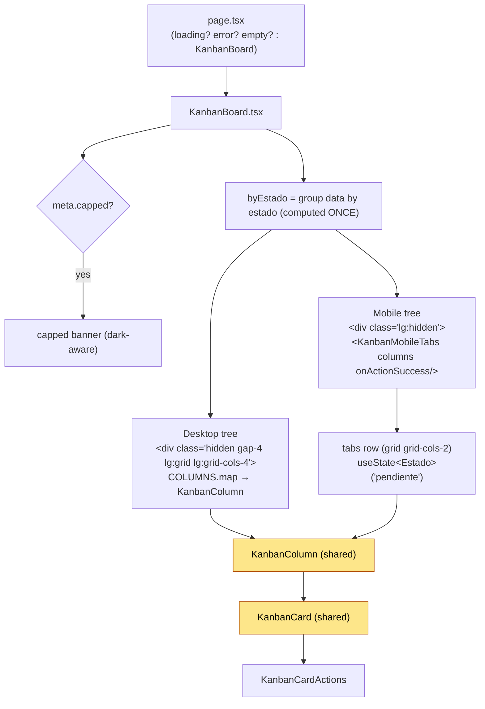

# Design: Visual/aesthetic redesign of `/ordenes-trabajo/panel` (desktop + mobile + dark mode)

## Technical Approach

This is a **presentational-only** pass over the six `panel/` component files. No data, endpoint, DTO,
fetch lifecycle, action handler, or behavior changes — every constraint in the proposal's D1 and the
Non-Goals list is honored byte-for-byte. The work is three coordinated efforts, all confined to
`client/app/(dashboard)/ordenes-trabajo/panel/`:

1. **Systematic dark mode** — a single canonical light→dark class mapping (see §1) applied uniformly
   across all six files, so every surface reads correctly against the dashboard's `dark:bg-gray-950`
   shell (verified in `layout.tsx:25`).
2. **Concrete mobile fixes** — even stats/workload grid wrapping, filter-bar `flex-col → sm:flex-row`
   stacking, and a definitive card-action button-wrap fix.
3. **Kanban responsive fork** — a CSS-only `lg` fork: a polished multi-column **grid** on desktop, a
   **tab/segmented-control** switcher (one estado column at a time, each tab carrying its count) below
   `lg`, sharing the exact same column/card rendering code so there is zero markup drift.

### Environment facts verified (design is grounded on real code, not assumptions)

| Fact | Source | Consequence for this design |
|------|--------|-----------------------------|
| `darkMode: 'class'` | `tailwind.config.ts:4` | `dark:` variants are live; no config change (honors D8). |
| Dark toggled by `document.documentElement.classList.add/remove('dark')` | `theme.tsx:24-33` | Design against the real `.dark` root-class mechanism; nothing else to wire. |
| Dashboard shell bg is `bg-gray-50 dark:bg-gray-950` | `layout.tsx:25` | Panel dark surfaces must sit legibly on **gray-950** (near-black). |
| Main content padding is `p-4 md:p-6` | `layout.tsx:34` | Content width = viewport − 32px (mobile) / − 48px (md+). |
| Sidebar is a `fixed ... -translate-x-full` **overlay drawer at every breakpoint** | `Sidebar.tsx:123-126` | The sidebar **never** reduces main content width — not even at `lg`. So content width at `lg` (1024px) ≈ 1024 − 48 = **976px**. This is the number the Kanban math below uses. |
| House icon convention: `viewBox="0 0 24 24" fill="none" stroke="currentColor" strokeWidth={1.5}` + `className="h-4 w-4 shrink-0"` | `clientes/page.tsx:22-64` | New icons copy these exact attributes; `PencilIcon`/`NoSymbolIcon`/`CheckCircleIcon` SVG paths are reused verbatim. |
| Clientes filter stacks via `flex flex-col gap-4 sm:flex-row sm:items-end` | `clientes/page.tsx:306` | `PanelFilters` mirrors this exact pattern. |
| `tailwind.config.ts` has only `slide-in-*` keyframes, no color/spacing tokens | `tailwind.config.ts:8-21` | No tokens to lean on; use stock utilities only (D8). Transitions use built-in `transition`/`duration-*`. |

No `'use client'` directive changes are needed except on the one new stateful file (`KanbanMobileTabs.tsx`).
`KanbanBoard.tsx`, `PanelStats.tsx`, `PanelFilters.tsx`, `MecanicosWorkload.tsx`, and the new
`KanbanColumn.tsx`/`PanelStateBox.tsx` remain non-`'use client'` presentational modules already in the
client graph via `page.tsx`.

### File inventory

| File | Change | Role |
|------|--------|------|
| `panel/page.tsx` | **MODIFIED** | Section spacing polish; the two duplicated state-box ternaries render `<PanelStateBox>`; header dark already present. Fetch logic / ternary conditions untouched. |
| `panel/PanelStats.tsx` | **MODIFIED** | Grid ladder fix; dark mode; one icon per tile. |
| `panel/PanelFilters.tsx` | **MODIFIED** | `flex-col → sm:flex-row` restructure; dark mode on container/labels/`selectClassName`. |
| `panel/KanbanBoard.tsx` | **MODIFIED** | Splits render into the desktop grid tree (`hidden lg:grid`) and the mobile tree (`lg:hidden` → `<KanbanMobileTabs>`); computes per-estado buckets once and feeds both. |
| `panel/KanbanCardActions.tsx` | **MODIFIED** | Button-wrap fix (2-row grid, icon-assisted); dark mode. Handlers/`Link`/guards untouched. |
| `panel/MecanicosWorkload.tsx` | **MODIFIED** | Grid tuning; dark mode incl. load-bar track + fill; heading icon. |
| `panel/KanbanColumn.tsx` | **NEW** (presentational) | Shared `KanbanColumn` + `KanbanCard` + the estado maps/helpers, extracted from `KanbanBoard.tsx` so **both** the desktop and mobile trees import the identical rendering code (ADR-A). |
| `panel/KanbanMobileTabs.tsx` | **NEW** (`'use client'`) | The mobile tab switcher: `useState<Estado>('pendiente')` + tabs row + renders the single active `<KanbanColumn>`. |
| `panel/PanelStateBox.tsx` | **NEW** (presentational) | Shared loading/error/empty box (D9). |

Three new sibling files, all inside `panel/` (honors D4 "keep the blast radius inside `panel/`"). This
extends the panel's established "declare per surface" convention already used across `PanelStats`,
`PanelFilters`, `KanbanBoard`, `MecanicosWorkload`, and `KanbanCardActions`.

---

## 1. Dark-mode color mapping (the core deliverable — defined ONCE, applied everywhere)

Every `dark:` class in every file below is derived from this table. There are **no ad-hoc per-component
color choices** — a reviewer can verify dark-mode correctness by checking each surface against this one
mapping. The rule for colored status badges is uniform: light `bg-{c}-100 text-{c}-700` becomes
`dark:bg-{c}-500/15 dark:text-{c}-300` (a low-alpha tint fill + a light-300 text that stays legible on
gray-950). Tinted column containers use a softer `/10` fill + `/20` border.

### 1.1 Neutral surfaces & text

| Semantic role | Light class | Dark class to append |
|---------------|-------------|----------------------|
| Card / tile / panel background | `bg-white` | `dark:bg-stone-900` |
| Inner nested card (on a tinted column) | `bg-white` | `dark:bg-stone-900` |
| Default border | `border-stone-200` | `dark:border-stone-700` |
| Faint inner divider/border | `border-stone-100` | `dark:border-stone-800` |
| Track / muted chip background | `bg-stone-100` | `dark:bg-stone-800` |
| Heading text (h1/number) | `text-stone-900` | `dark:text-stone-50` |
| Strong body / labels | `text-stone-800` | `dark:text-stone-100` |
| Section heading | `text-stone-700` | `dark:text-stone-200` |
| Body text | `text-stone-700` / `text-stone-600` | `dark:text-stone-300` |
| Muted text (units, captions) | `text-stone-500` | `dark:text-stone-400` |
| Faint text (Ingreso line) | `text-stone-400` | `dark:text-stone-500` |
| Neutral badge | `bg-stone-100 text-stone-700` | `dark:bg-stone-800 dark:text-stone-300` |
| Spinner ring | `border-stone-300 border-t-rose-500` | `dark:border-stone-700 dark:border-t-rose-500` |

### 1.2 Colored status badges/pills (`bg-{c}-100 text-{c}-700 → dark:bg-{c}-500/15 dark:text-{c}-300`)

| Color | Light | Dark to append |
|-------|-------|----------------|
| amber (pendiente) | `bg-amber-100 text-amber-700` | `dark:bg-amber-500/15 dark:text-amber-300` |
| sky (en proceso) | `bg-sky-100 text-sky-700` | `dark:bg-sky-500/15 dark:text-sky-300` |
| green (terminado) | `bg-green-100 text-green-700` | `dark:bg-green-500/15 dark:text-green-300` |
| red (cancelado / urgente) | `bg-red-100 text-red-700` | `dark:bg-red-500/15 dark:text-red-300` |
| purple (mecánicos) | `bg-purple-100 text-purple-700` | `dark:bg-purple-500/15 dark:text-purple-300` |
| blue (prioridad normal) | `bg-blue-100 text-blue-700` | `dark:bg-blue-500/15 dark:text-blue-300` |
| orange (prioridad alta) | `bg-orange-100 text-orange-700` | `dark:bg-orange-500/15 dark:text-orange-300` |
| stone (total) | `bg-stone-100 text-stone-700` | `dark:bg-stone-800 dark:text-stone-300` |

### 1.3 Tinted column containers (Kanban)

| Estado | Light container / title | Dark to append |
|--------|------------------------|----------------|
| pendiente | `border-amber-200 bg-amber-50` / `text-amber-800` | `dark:border-amber-500/20 dark:bg-amber-500/10` / `dark:text-amber-300` |
| en_proceso | `border-sky-200 bg-sky-50` / `text-sky-800` | `dark:border-sky-500/20 dark:bg-sky-500/10` / `dark:text-sky-300` |
| terminado | `border-green-200 bg-green-50` / `text-green-800` | `dark:border-green-500/20 dark:bg-green-500/10` / `dark:text-green-300` |
| cancelado | `border-red-200 bg-red-50` / `text-red-800` | `dark:border-red-500/20 dark:bg-red-500/10` / `dark:text-red-300` |

### 1.4 Semantic accent surfaces (errors, capped banner, filter inputs, buttons, load bar)

| Surface | Light | Dark to append |
|---------|-------|----------------|
| Error box | `border-red-200 bg-red-50 text-red-600` | `dark:border-red-500/30 dark:bg-red-500/10 dark:text-red-300` |
| Error retry link | `text-red-700 hover:text-red-800` | `dark:text-red-300 dark:hover:text-red-200` |
| Capped banner | `border-amber-200 bg-amber-50 text-amber-700` | `dark:border-amber-500/30 dark:bg-amber-500/10 dark:text-amber-300` |
| Filter input (`selectClassName`) | `bg-white border-stone-200 text-stone-700 focus:border-rose-400 focus:ring-rose-100` | `dark:bg-stone-900 dark:border-stone-700 dark:text-stone-200 dark:focus:border-rose-500 dark:focus:ring-rose-500/30` |
| Filter label | `text-stone-700` | `dark:text-stone-300` |
| **Iniciar gradient CTA** | `bg-gradient-to-r from-rose-500 to-red-500 text-white` | **no dark override** — the vivid rose→red gradient + white text already contrasts strongly on gray-950 (verified visually acceptable; matches the app's `rose-500/30`-shadowed CTAs). Hover `hover:from-rose-600 hover:to-red-600` unchanged. |
| Editar outlined | `border-stone-200 text-stone-600 hover:bg-stone-50` | `dark:border-stone-700 dark:text-stone-300 dark:hover:bg-stone-800` |
| Desactivar outlined | `border-rose-200 text-rose-600 hover:bg-rose-50` | `dark:border-rose-500/30 dark:text-rose-300 dark:hover:bg-rose-500/10` |
| Load-bar track | `bg-stone-100` | `dark:bg-stone-800` |
| **Load-bar gradient fill** | `bg-gradient-to-r from-rose-500 to-red-400` | **no dark override** — a saturated rose→red fill reads clearly against both the `dark:bg-stone-800` track and the gray-950 shell (confirmed: `rose-500`/`red-400` are mid-tone, high-chroma, legible on dark). |

**Two decisions this table locks (see ADR-D):** the Iniciar CTA gradient and the load-bar fill gradient
are deliberately **kept identical** in dark mode — both are high-chroma mid-tones that already pass
contrast on gray-950; forcing a dark variant would only mute them. Everything else gets an explicit
`dark:` pair.

---

## 2. `page.tsx` — spacing polish + `PanelStateBox` unification

### 2.1 What does NOT change (guard)

`toYmd`, `mondayOfWeek`, `firstOfMonth`, `resolveDateWindow`, all `useState`/`useEffect` hooks,
`loadPanel`, `loadWorkload`, the mecánicos `listUsers` effect, and — critically — **the two ternary
chains' branch conditions** (`loading ? … : error ? … : !result || result.data.length === 0 ? … : …`
and the workload equivalent) are untouched. Only the JSX **inside** each non-`KanbanBoard`/
non-`MecanicosWorkload` branch changes: the three inline `<div>` boxes become `<PanelStateBox>`.

### 2.2 `PanelStateBox` — exact interface (new file `panel/PanelStateBox.tsx`)

```tsx
// panel/PanelStateBox.tsx — presentational only, no hooks, no 'use client'.
type PanelStateVariant = 'loading' | 'error' | 'empty';

interface PanelStateBoxProps {
  variant: PanelStateVariant;
  message: string;
  onRetry?: () => void;   // rendered only when variant === 'error'
  className?: string;      // caller supplies top margin (panel uses mt-6, workload mt-8)
}

export default function PanelStateBox({ variant, message, onRetry, className = '' }: PanelStateBoxProps) {
  if (variant === 'error') {
    return (
      <div
        className={`flex items-center justify-between gap-3 rounded-lg border border-red-200 bg-red-50 px-4 py-3 text-sm text-red-600 dark:border-red-500/30 dark:bg-red-500/10 dark:text-red-300 ${className}`}
      >
        <span>{message}</span>
        {onRetry && (
          <button
            type="button"
            onClick={onRetry}
            className="shrink-0 font-medium text-red-700 underline hover:text-red-800 dark:text-red-300 dark:hover:text-red-200"
          >
            Reintentar
          </button>
        )}
      </div>
    );
  }

  if (variant === 'loading') {
    return (
      <div
        className={`flex items-center justify-center gap-2 rounded-xl border border-stone-200 bg-white p-8 text-sm text-stone-500 shadow-sm dark:border-stone-700 dark:bg-stone-900 dark:text-stone-400 ${className}`}
      >
        <span
          className="h-4 w-4 animate-spin rounded-full border-2 border-stone-300 border-t-rose-500 dark:border-stone-700 dark:border-t-rose-500"
          aria-hidden="true"
        />
        {message}
      </div>
    );
  }

  // 'empty'
  return (
    <div
      className={`rounded-xl border border-stone-200 bg-white p-8 text-center text-sm text-stone-500 shadow-sm dark:border-stone-700 dark:bg-stone-900 dark:text-stone-400 ${className}`}
    >
      {message}
    </div>
  );
}
```

The three variants reproduce the current three box stylings **verbatim** (same padding, radius, border,
shadow, spinner markup) plus the §1 dark pairs — so this is a pure de-duplication, not a restyle. The
`className` prop preserves the exact per-caller top-margin (`mt-6` for the panel boxes, `mt-8` for the
workload boxes) without baking spacing into the shared component.

### 2.3 `page.tsx` — resulting branch JSX

```tsx
import PanelStateBox from './PanelStateBox';   // NEW import

// header block: UNCHANGED (already has dark:text-stone-50 / dark:text-stone-400)

{loading ? (
  <PanelStateBox variant="loading" message="Cargando panel de trabajo..." className="mt-6" />
) : error ? (
  <PanelStateBox variant="error" message={error} onRetry={loadPanel} className="mt-6" />
) : !result || result.data.length === 0 ? (
  <PanelStateBox
    variant="empty"
    message="No se encontraron órdenes con los filtros seleccionados."
    className="mt-6"
  />
) : (
  <KanbanBoard data={result.data} meta={result.meta} onActionSuccess={loadPanel} />
)}

{/* Per-mechanic workload — independent of the filter bar (D1). Conditions UNCHANGED. */}
{workloadLoading ? (
  <PanelStateBox variant="loading" message="Cargando carga por mecánico..." className="mt-8" />
) : workloadError ? (
  <PanelStateBox variant="error" message={workloadError} onRetry={loadWorkload} className="mt-8" />
) : mecanicosWorkload && mecanicosWorkload.length > 0 ? (
  <MecanicosWorkload mecanicos={mecanicosWorkload} />
) : (
  <PanelStateBox
    variant="empty"
    message="No hay mecánicos activos para mostrar."
    className="mt-8"
  />
)}
```

Note the error branches now pass `onRetry` (previously an inline `loadPanel`/`loadWorkload` button) — the
handler references are identical; only their JSX home moves into the shared component. The `PanelStats`
line (`{result && <PanelStats .../>}`) and the two component mounts (`KanbanBoard`, `MecanicosWorkload`)
are unchanged. Section rhythm stays the current `mt-6` (stats/filters/board) / `mt-8` (workload) ladder —
consistent and preserved via the `className` prop.

---

## 3. `PanelStats.tsx` — grid ladder + dark + per-tile icons

### 3.1 Grid ladder math (fixing the 2-2-1 orphan)

There are **5 tiles**. 5 is prime, so the only column counts that wrap it with **no orphaned cell** are
1 (5 rows) and 5 (1 row). Any count in 2–4 orphans the trailing tile — the current `grid-cols-2` produces
exactly the reported 2-2-1 split. Therefore:

**`grid grid-cols-1 gap-3 sm:grid-cols-3 lg:grid-cols-5`**

- **base `grid-cols-1`** (< 640px): all five tiles full-width stacked — **eliminates the orphan entirely**
  (the proposal's named mobile bug). Compact tiles, acceptable vertical rhythm.
- **`sm:grid-cols-3`** (640–1023px): 5 → a balanced **3-over-2** (last row centered-left with one empty
  cell) — materially better than 2-2-1, and tiles are wide enough at this width that the single gap reads
  as intentional.
- **`lg:grid-cols-5`** (≥ 1024px): single clean row — the design's target premium layout.

### 3.2 Updated maps (dark added)

```tsx
const ESTADO_BADGE_CLASSES: Record<Estado, string> = {
  pendiente: 'bg-amber-100 text-amber-700 dark:bg-amber-500/15 dark:text-amber-300',
  en_proceso: 'bg-sky-100 text-sky-700 dark:bg-sky-500/15 dark:text-sky-300',
  terminado: 'bg-green-100 text-green-700 dark:bg-green-500/15 dark:text-green-300',
  cancelado: 'bg-red-100 text-red-700 dark:bg-red-500/15 dark:text-red-300',
};
// inline badges:
//   Total   → 'bg-stone-100 text-stone-700 dark:bg-stone-800 dark:text-stone-300'
//   Mecánicos → 'bg-purple-100 text-purple-700 dark:bg-purple-500/15 dark:text-purple-300'
```

### 3.3 Per-tile icon (D6)

Each `Figure` gains an `icon: JSX.Element` field. One restrained icon per tile, `h-5 w-5`, tinted to the
figure's accent (matching its badge family) with a dark pair. The tile top row becomes
`flex items-center justify-between` with the badge on the left and the icon on the right.

| Tile | Icon (see §9) | Icon color class |
|------|---------------|------------------|
| Total de órdenes | `SquaresIcon` | `text-stone-400 dark:text-stone-500` |
| Pendientes | `ClockIcon` | `text-amber-500 dark:text-amber-400` |
| En proceso | `WrenchIcon` | `text-sky-500 dark:text-sky-400` |
| Terminados | `CheckCircleIcon` | `text-green-500 dark:text-green-400` |
| Mecánicos trabajando | `UsersIcon` | `text-purple-500 dark:text-purple-400` |

### 3.4 Resulting tile JSX

```tsx
<div className="grid grid-cols-1 gap-3 sm:grid-cols-3 lg:grid-cols-5">
  {figures.map((figure) => (
    <div
      key={figure.label}
      className="flex flex-col gap-2 rounded-xl border border-stone-200 bg-white p-4 shadow-sm transition-colors dark:border-stone-700 dark:bg-stone-900"
    >
      <div className="flex items-center justify-between gap-2">
        <span className={`w-fit rounded-full px-2.5 py-1 text-xs font-semibold ${figure.badgeClass}`}>
          {figure.label}
        </span>
        <span className={figure.iconClass}>{figure.icon}</span>
      </div>
      <span className="flex items-baseline gap-1.5">
        <span className="text-2xl font-bold text-stone-900 dark:text-stone-50">{figure.value}</span>
        <span className="text-xs text-stone-500 dark:text-stone-400">{figure.unit(figure.value)}</span>
      </span>
    </div>
  ))}
</div>
```

---

## 4. `PanelFilters.tsx` — `flex-col → sm:flex-row` + dark

### 4.1 Restructure (mirrors `clientes/page.tsx:306`)

The single `<div className="flex flex-wrap items-end gap-4">` (line 53) becomes the Clientes filter
pattern. The Clientes page uses:

```tsx
<div className="flex flex-col gap-4 sm:flex-row sm:items-end">
  <div className="grid flex-1 grid-cols-1 gap-4 sm:grid-cols-[1fr_auto_auto]"> … </div>
</div>
```

For the panel there are up to 6 controls (4 base + 2 custom-date), so the inner grid uses an even
auto-flow instead of a fixed template:

```tsx
<div className="flex flex-col gap-4 sm:flex-row sm:flex-wrap sm:items-end">
  {/* each control is a direct child; full-width stacked on mobile, sized on sm+ */}
</div>
```

Each control wrapper drops its fixed `w-48`/`w-40` on mobile and applies it only at `sm`:

- Mecánico: `className="w-full space-y-1 sm:w-48"`
- Estado / Prioridad / Fecha / Desde / Hasta: `className="w-full space-y-1 sm:w-40"`

Result: on mobile every control is a full-width stacked row (label above input); at `sm+` they lay out
horizontally and wrap gracefully via `sm:flex-wrap`, exactly like the Clientes filter panel.

### 4.2 Dark classes

```tsx
// container (line 52):
"mt-6 rounded-xl border border-stone-200 bg-white p-4 shadow-sm dark:border-stone-700 dark:bg-stone-900"

// every label (5×):  add  dark:text-stone-300  to the existing "text-sm font-medium text-stone-700"

// the shared selectClassName string — full dark pair spelled out:
const selectClassName =
  'w-full rounded-lg border border-stone-200 bg-white px-3 py-2 text-sm text-stone-700 ' +
  'focus:border-rose-400 focus:outline-none focus:ring-2 focus:ring-rose-100 ' +
  'dark:border-stone-700 dark:bg-stone-900 dark:text-stone-200 ' +
  'dark:focus:border-rose-500 dark:focus:ring-rose-500/30';
```

`selectClassName` is applied to all four `<select>` and both `<input type="date">`, so the single string
carries the full light+dark spec for every control (background, border, text, and focus ring all read in
dark — the focus ring stays visible via `dark:focus:ring-rose-500/30`). This is the one place where the
same class needs the full light+dark pair spelled out in one literal.

---

## 5. `KanbanBoard.tsx` + `KanbanColumn.tsx` + `KanbanMobileTabs.tsx` — the responsive fork

### 5.1 Render structure diagram



The highlighted `KanbanColumn`/`KanbanCard` nodes are the **single shared rendering path** — both trees
call the identical component from `KanbanColumn.tsx`, so there is exactly one copy of the card markup
(ADR-A). The only difference between trees is the wrapping container and which estados render.

### 5.2 `KanbanColumn.tsx` (NEW — extracted shared rendering)

`KanbanCard`, `KanbanColumn`, and the estado maps/helpers (`ESTADO_LABELS`, `PRIORIDAD_LABELS`,
`PRIORIDAD_BADGE_CLASSES`, `COLUMN_CLASSES`, `COLUMNS`, `formatFecha`, `mecanicoLabel`) move out of
`KanbanBoard.tsx` into this new presentational file and are **exported**, so both `KanbanBoard.tsx` and
`KanbanMobileTabs.tsx` import them without a circular dependency (ADR-A rejects "export from KanbanBoard"
because KanbanBoard imports KanbanMobileTabs, which would import back from KanbanBoard).

```tsx
// panel/KanbanColumn.tsx  (no 'use client' — presentational, part of the client graph via importers)
import type { Estado, OrdenTrabajoListItem, Prioridad } from '../../../lib/ordenes-trabajo';
import KanbanCardActions from './KanbanCardActions';

export const ESTADO_LABELS: Record<Estado, string> = {
  pendiente: 'Pendiente', en_proceso: 'En proceso', terminado: 'Terminado', cancelado: 'Cancelado',
};
export const PRIORIDAD_LABELS: Record<Prioridad, string> = {
  normal: 'Normal', alta: 'Alta', urgente: 'Urgente',
};
export const PRIORIDAD_BADGE_CLASSES: Record<Prioridad, string> = {
  normal: 'bg-blue-100 text-blue-700 dark:bg-blue-500/15 dark:text-blue-300',
  alta: 'bg-orange-100 text-orange-700 dark:bg-orange-500/15 dark:text-orange-300',
  urgente: 'bg-red-100 text-red-700 dark:bg-red-500/15 dark:text-red-300',
};
export const COLUMNS: Estado[] = ['pendiente', 'en_proceso', 'terminado', 'cancelado'];
export const COLUMN_CLASSES: Record<Estado, { container: string; title: string; count: string }> = {
  pendiente: {
    container: 'border-amber-200 bg-amber-50 dark:border-amber-500/20 dark:bg-amber-500/10',
    title: 'text-amber-800 dark:text-amber-300',
    count: 'bg-amber-100 text-amber-700 dark:bg-amber-500/15 dark:text-amber-300',
  },
  en_proceso: {
    container: 'border-sky-200 bg-sky-50 dark:border-sky-500/20 dark:bg-sky-500/10',
    title: 'text-sky-800 dark:text-sky-300',
    count: 'bg-sky-100 text-sky-700 dark:bg-sky-500/15 dark:text-sky-300',
  },
  terminado: {
    container: 'border-green-200 bg-green-50 dark:border-green-500/20 dark:bg-green-500/10',
    title: 'text-green-800 dark:text-green-300',
    count: 'bg-green-100 text-green-700 dark:bg-green-500/15 dark:text-green-300',
  },
  cancelado: {
    container: 'border-red-200 bg-red-50 dark:border-red-500/20 dark:bg-red-500/10',
    title: 'text-red-800 dark:text-red-300',
    count: 'bg-red-100 text-red-700 dark:bg-red-500/15 dark:text-red-300',
  },
};

function formatFecha(iso: string): string {
  const [year, month, day] = iso.slice(0, 10).split('-');
  return `${day}/${month}/${year}`;
}
function mecanicoLabel(mecanico: OrdenTrabajoListItem['mecanico']): string {
  const fullName = `${mecanico.nombre ?? ''} ${mecanico.apellido ?? ''}`.trim();
  return fullName || mecanico.username;
}

export function KanbanCard({
  orden, onActionSuccess,
}: { orden: OrdenTrabajoListItem; onActionSuccess: () => void }) {
  return (
    <div className="flex flex-col gap-2 rounded-lg border border-stone-200 bg-white p-3 shadow-sm dark:border-stone-700 dark:bg-stone-900">
      <div className="flex items-center justify-between gap-2">
        <span className="text-sm font-bold text-stone-800 dark:text-stone-100">{orden.numero ?? '—'}</span>
        <span className={`rounded-full px-2 py-0.5 text-xs font-medium ${PRIORIDAD_BADGE_CLASSES[orden.prioridad]}`}>
          {PRIORIDAD_LABELS[orden.prioridad]}
        </span>
      </div>

      <div className="space-y-0.5 text-xs text-stone-600 dark:text-stone-300">
        <p><span className="font-medium text-stone-800 dark:text-stone-100">Cliente:</span> {orden.cliente.razonSocial}</p>
        <p><span className="font-medium text-stone-800 dark:text-stone-100">Vehículo:</span> {orden.vehiculo.marca.marca} {orden.vehiculo.marca.modelo}</p>
        <p><span className="font-medium text-stone-800 dark:text-stone-100">Mecánico:</span> {mecanicoLabel(orden.mecanico)}</p>
      </div>

      {orden.tiposServicio.length > 0 && (
        <div className="flex flex-wrap gap-1">
          {orden.tiposServicio.map((tipo) => (
            <span key={tipo.id} className="rounded-full bg-stone-100 px-2 py-0.5 text-xs font-medium text-stone-600 dark:bg-stone-800 dark:text-stone-300">
              {tipo.descripcion}
            </span>
          ))}
        </div>
      )}

      <p className="text-xs text-stone-400 dark:text-stone-500">Ingreso: {formatFecha(orden.fechaIngreso)}</p>

      <KanbanCardActions orden={orden} onActionSuccess={onActionSuccess} />
    </div>
  );
}

export function KanbanColumn({
  estado, ordenes, onActionSuccess,
}: { estado: Estado; ordenes: OrdenTrabajoListItem[]; onActionSuccess: () => void }) {
  const classes = COLUMN_CLASSES[estado];
  return (
    <div className={`flex min-w-0 flex-col gap-3 rounded-xl border p-3 ${classes.container}`}>
      <div className="flex items-center justify-between px-1">
        <h3 className={`text-sm font-semibold ${classes.title}`}>{ESTADO_LABELS[estado]}</h3>
        <span className={`rounded-full px-2 py-0.5 text-xs font-semibold shadow-sm ${classes.count}`}>
          {ordenes.length}
        </span>
      </div>
      <div className="flex flex-col gap-2">
        {ordenes.length === 0 ? (
          <p className="px-1 text-xs text-stone-400 dark:text-stone-500">Sin órdenes</p>
        ) : (
          ordenes.map((orden) => (
            <KanbanCard key={orden.id} orden={orden} onActionSuccess={onActionSuccess} />
          ))
        )}
      </div>
    </div>
  );
}
```

**Key delta vs. today:** the column container drops `min-w-[260px] flex-1` → **`min-w-0`**. In the
desktop `grid-cols-4` tree the grid track sets the width; in the mobile tree the column is a single
full-width block. `min-w-0` lets the column shrink to its grid/flex track without forcing overflow (see
§5.5 math).

### 5.3 `KanbanMobileTabs.tsx` (NEW — `'use client'`)

```tsx
'use client';

import { useState } from 'react';
import type { Estado, OrdenTrabajoListItem } from '../../../lib/ordenes-trabajo';
import { KanbanColumn, ESTADO_LABELS, COLUMN_CLASSES } from './KanbanColumn';

interface KanbanMobileTabsProps {
  columns: { estado: Estado; ordenes: OrdenTrabajoListItem[] }[];
  onActionSuccess: () => void;
}

export default function KanbanMobileTabs({ columns, onActionSuccess }: KanbanMobileTabsProps) {
  // D5: default to 'pendiente'; ephemeral, resets on remount, no persistence.
  const [active, setActive] = useState<Estado>('pendiente');
  const activeColumn = columns.find((c) => c.estado === active) ?? columns[0];

  return (
    <div className="flex flex-col gap-4">
      {/* Tabs row — 2×2 grid so all four labels+counts are fully visible at 375px
          (a single-row segmented control would reintroduce the horizontal-scroll
          sliver the redesign removes). */}
      <div className="grid grid-cols-2 gap-2">
        {columns.map(({ estado, ordenes }) => {
          const isActive = estado === active;
          return (
            <button
              key={estado}
              type="button"
              onClick={() => setActive(estado)}
              aria-pressed={isActive}
              className={`flex items-center justify-between gap-2 rounded-lg border px-3 py-2 text-sm font-semibold transition-colors ${
                isActive
                  ? 'border-rose-300 bg-white text-stone-900 shadow-sm dark:border-rose-500/40 dark:bg-stone-900 dark:text-stone-50'
                  : 'border-transparent bg-stone-100 text-stone-500 hover:bg-stone-200 dark:bg-stone-800 dark:text-stone-400 dark:hover:bg-stone-700'
              }`}
            >
              <span className="truncate">{ESTADO_LABELS[estado]}</span>
              <span className={`shrink-0 rounded-full px-2 py-0.5 text-xs font-semibold ${COLUMN_CLASSES[estado].count}`}>
                {ordenes.length}
              </span>
            </button>
          );
        })}
      </div>

      {/* The single active column — reuses the SAME KanbanColumn as desktop. */}
      <KanbanColumn
        estado={activeColumn.estado}
        ordenes={activeColumn.ordenes}
        onActionSuccess={onActionSuccess}
      />
    </div>
  );
}
```

Every tab (active or not) shows its estado's **count pill in the estado color**, so column sizes are
visible without switching (proposal requirement). The active tab is a raised white/stone-900 pill with a
rose border accent; inactive tabs are muted stone. The active column renders through the identical
`KanbanColumn`, guaranteeing card parity with desktop.

### 5.4 `KanbanBoard.tsx` (MODIFIED — the fork)

```tsx
import type { Estado, OrdenTrabajoListItem } from '../../../lib/ordenes-trabajo';
import { KanbanColumn, COLUMNS } from './KanbanColumn';
import KanbanMobileTabs from './KanbanMobileTabs';

interface KanbanBoardProps {
  data: OrdenTrabajoListItem[];
  meta: { total: number; cap: number; capped: boolean };
  onActionSuccess: () => void;
}

export default function KanbanBoard({ data, meta, onActionSuccess }: KanbanBoardProps) {
  // Group ONCE; feed both trees (static column order so empty estados still show).
  const columns = COLUMNS.map((estado) => ({
    estado,
    ordenes: data.filter((orden) => orden.estado === estado),
  }));

  return (
    <div className="mt-6">
      {meta.capped && (
        <div className="mb-3 rounded-lg border border-amber-200 bg-amber-50 px-4 py-3 text-sm text-amber-700 dark:border-amber-500/30 dark:bg-amber-500/10 dark:text-amber-300">
          Mostrando las primeras {meta.cap} de {meta.total} órdenes. Ajustá los filtros para acotar.
        </div>
      )}

      {/* Desktop tree: CSS-hidden below lg. 4-column grid → no horizontal scroll (§5.5). */}
      <div className="hidden gap-4 lg:grid lg:grid-cols-4">
        {columns.map(({ estado, ordenes }) => (
          <KanbanColumn key={estado} estado={estado} ordenes={ordenes} onActionSuccess={onActionSuccess} />
        ))}
      </div>

      {/* Mobile tree: CSS-hidden at lg+. Tab switcher, one column at a time. */}
      <div className="lg:hidden">
        <KanbanMobileTabs columns={columns} onActionSuccess={onActionSuccess} />
      </div>
    </div>
  );
}
```

Both trees are always in the DOM; CSS (`hidden`/`lg:grid` vs `lg:hidden`) picks which renders. No JS
width check → no hydration mismatch (D3). The only new JS state (`active` tab) lives inside the
already-CSS-hidden mobile tree and never affects SSR output.

### 5.5 `lg` breakpoint — math resolution (grid, not flex+overflow)

The proposal fixed the breakpoint at `lg` (1024px). The open question was whether the **desktop tree**
looks good at exactly `lg`. Math with verified widths:

- Content width at `lg` = viewport − main `md:p-6` padding = 1024 − 48 = **976px** (the sidebar is a
  fixed overlay and does **not** subtract width — verified §Environment facts).
- The **current** desktop layout is `flex ... overflow-x-auto` with each column `min-w-[260px]` + `gap-4`
  (16px): 4×260 + 3×16 = **1088px**. Since 1088 > 976, the current flex layout **would horizontally
  scroll at `lg`** — re-introducing exactly the scroll affordance the redesign removes.

**Resolution:** the desktop tree switches from `flex + overflow-x-auto + min-w-[260px]` to
**`lg:grid lg:grid-cols-4 gap-4`** with columns at **`min-w-0`**. A 4-track grid divides the available
width evenly: at `lg` each column = (976 − 48 gaps) / 4 = **232px**; at `xl` (1280px) = (1232 − 48)/4 =
**296px**; wider still, more comfortable. 232px columns comfortably hold the card content (card inner
width 232 − 24 padding = 208px; the card body is `text-xs`, and the action buttons use the 2-row grid
of §6 which fits from ~200px up). This **eliminates horizontal scroll at every `lg`+ width** — strictly
better than the flex+overflow layout at the boundary — so `lg` is confirmed with no downward adjustment
needed. (Below `lg` the tab switcher renders, so the desktop tree never has to cope with < 1024px.)
This grid-over-flex choice is recorded as ADR-E.

---

## 6. `KanbanCardActions.tsx` — definitive button-wrap fix

### 6.1 What does NOT change (guard)

`handleIniciar` (incl. the `orden.estado === 'pendiente'` API branch and the `router.push`),
`handleDesactivar` (the `showConfirm` → full-object `{ ...fields, activo: false }` PATCH →
`showSuccess`/`showError` → `onActionSuccess()` flow), the `iniciando`/`desactivando` state, the
`orden.estado !== 'cancelado'` Iniciar guard, and the Editar `<Link href>` are **byte-for-byte
unchanged**. Only the wrapping container's layout classes and per-button classes/icons change.

### 6.2 The fix — definitive choice: 2-row grid with icon-assisted labels (ADR-C)

The current `flex flex-wrap gap-1.5` with three `flex-1` buttons wraps badly in a narrow column: at the
desktop grid's 208px inner width, three equal `flex-1` slots are ~65px each, too narrow for
"Iniciar trabajo" → it wraps to a lopsided 2+1. **Chosen fix (option d + a):** a **CSS grid** where the
primary Iniciar CTA spans a full row and the two outlined secondary actions share the row below; all
three carry a leading icon. This is deterministic at any width ≥ ~180px (no flex-wrap guesswork) and
reads as a clear primary/secondary hierarchy.

- Container: `grid grid-cols-2 gap-1.5` on a `border-t` divider.
- **Iniciar** (`estado !== 'cancelado'`): `col-span-2` → full-width top row.
- **Editar** and **Desactivar**: one grid cell each → side-by-side bottom row.
- On a `cancelado` card (no Iniciar): the grid holds exactly two items → Editar + Desactivar fill the
  single row. No empty cell, no orphan.

Each button becomes `inline-flex items-center justify-center gap-1.5` to seat its icon. Buttons drop
`flex-1` (grid handles sizing).

### 6.3 Resulting JSX

```tsx
return (
  <div className="grid grid-cols-2 gap-1.5 border-t border-stone-100 pt-2 dark:border-stone-800">
    {orden.estado !== 'cancelado' && (
      <button
        type="button"
        onClick={handleIniciar}
        disabled={iniciando}
        className="col-span-2 inline-flex items-center justify-center gap-1.5 rounded-lg bg-gradient-to-r from-rose-500 to-red-500 px-2 py-1.5 text-center text-xs font-semibold text-white shadow-sm transition-all hover:from-rose-600 hover:to-red-600 disabled:cursor-not-allowed disabled:opacity-50"
      >
        <PlayIcon />
        {iniciando ? 'Iniciando...' : 'Iniciar trabajo'}
      </button>
    )}

    <Link
      href={`/ordenes-trabajo/editar/${orden.id}`}
      className="inline-flex items-center justify-center gap-1.5 rounded-lg border border-stone-200 px-2 py-1.5 text-center text-xs font-semibold text-stone-600 transition-all hover:bg-stone-50 dark:border-stone-700 dark:text-stone-300 dark:hover:bg-stone-800"
    >
      <PencilIcon />
      Editar
    </Link>

    <button
      type="button"
      onClick={handleDesactivar}
      disabled={desactivando}
      className="inline-flex items-center justify-center gap-1.5 rounded-lg border border-rose-200 px-2 py-1.5 text-center text-xs font-semibold text-rose-600 transition-all hover:bg-rose-50 disabled:cursor-not-allowed disabled:opacity-50 dark:border-rose-500/30 dark:text-rose-300 dark:hover:bg-rose-500/10"
    >
      <NoSymbolIcon />
      {desactivando ? 'Desactivando...' : 'Desactivar'}
    </button>
  </div>
);
```

`PlayIcon`/`PencilIcon`/`NoSymbolIcon` are declared locally in this file per the house convention (§9),
each `h-4 w-4 shrink-0`. The gradient CTA keeps its light styling in dark mode per §1.4 (ADR-D). Editar
and Desactivar get the §1.4 outlined-button dark pairs. This 2-row grid is the design's **final**
button-wrap decision — `sdd-apply`/`sdd-verify` still confirm it against a live 375px render
(mobile single column ≈ 319px inner, roomier than the 208px desktop case the grid is sized for), but the
layout is not left open.

---

## 7. `MecanicosWorkload.tsx` — grid tuning + dark (incl. load bar)

### 7.1 Grid for a variable-length list

Unlike the fixed-5 stats grid, this is a variable list, so a CSS grid already wraps it gracefully — grid
cells do **not** stretch a lone trailing item to full width (that only happens with `flex-1`/flex-grow),
so an odd count simply leaves a normal empty cell in the last row, which is the expected list behavior.
The ladder is tuned for even wrapping at each width:

**`grid grid-cols-2 gap-3 sm:grid-cols-3 lg:grid-cols-4`** (unchanged column counts, kept because they
wrap any count acceptably) — a 2-col mobile layout keeps each mecánico card readable at 375px (≈165px
each, name truncates via the existing `truncate`), 3-col at tablet, 4-col at desktop. No orphan-stretch
risk because it is a grid, not a flex row.

### 7.2 Dark classes + heading icon

```tsx
<section className="mt-8">
  <h2 className="flex items-center gap-2 text-sm font-semibold text-stone-700 dark:text-stone-200">
    <ChartBarIcon />               {/* text-stone-400 dark:text-stone-500 */}
    Carga por mecánico
  </h2>
  <div className="mt-3 grid grid-cols-2 gap-3 sm:grid-cols-3 lg:grid-cols-4">
    {mecanicos.map((m) => (
      <div
        key={m.mecanicoId}
        className="flex flex-col gap-2 rounded-xl border border-stone-200 bg-white p-4 shadow-sm dark:border-stone-700 dark:bg-stone-900"
      >
        <span className="truncate text-sm font-medium text-stone-700 dark:text-stone-200" title={mecanicoLabel(m)}>
          {mecanicoLabel(m)}
        </span>
        <span className="flex items-baseline gap-1.5">
          <span className="text-2xl font-bold text-stone-900 dark:text-stone-50">{m.count}</span>
          <span className="text-xs text-stone-500 dark:text-stone-400">{ordenesLabel(m.count)}</span>
        </span>

        {/* Load bar: dark track, gradient fill unchanged (§1.4). */}
        <div className="h-1.5 w-full overflow-hidden rounded-full bg-stone-100 dark:bg-stone-800">
          <div
            className="h-full rounded-full bg-gradient-to-r from-rose-500 to-red-400"
            style={{ width: `${m.percentage}%` }}
          />
        </div>
        <span className="text-xs text-stone-500 dark:text-stone-400">{m.percentage}% de la carga</span>
      </div>
    ))}
  </div>
</section>
```

The `style={{ width }}` inline percentage and `m.percentage`/`m.count`/`mecanicoLabel` logic are
untouched — only the track gets `dark:bg-stone-800` and the surrounding text/card get their §1 dark pairs.
The **gradient fill is deliberately unchanged** (`from-rose-500 to-red-400`): a high-chroma mid-tone that
reads clearly on both the dark track and the gray-950 shell (ADR-D).

---

## 8. Icons (D6) — house convention, reuse existing paths

All icons are hand-declared inline SVG components following the verified house convention
(`viewBox="0 0 24 24" fill="none" stroke="currentColor" strokeWidth={1.5}` + a `className` sized per use,
`shrink-0`). `PencilIcon`, `NoSymbolIcon`, and `CheckCircleIcon` reuse the **exact** SVG paths already in
`clientes/page.tsx` (lines 22-52) — no new path invented where one exists in the house style. Icons are
declared locally in the file that uses them (per-surface convention), sized `h-4 w-4` on buttons and
`h-5 w-5` on stat tiles / section headings.

| Icon | Where | `d` path (single `<path strokeLinecap="round" strokeLinejoin="round" d="…" />` unless noted) |
|------|-------|---------------------------------------------------------------------------------------------|
| `PencilIcon` (reuse) | Editar button | `M16.862 4.487l1.687-1.688a1.875 1.875 0 112.652 2.652L10.582 16.07a4.5 4.5 0 01-1.897 1.13L6 18l.8-2.685a4.5 4.5 0 011.13-1.897l8.932-8.931zm0 0L19.5 7.125M18 14v4.75A2.25 2.25 0 0115.75 21H5.25A2.25 2.25 0 013 18.75V8.25A2.25 2.25 0 015.25 6H10` |
| `NoSymbolIcon` (reuse) | Desactivar button | `M18.364 18.364A9 9 0 005.636 5.636m12.728 12.728A9 9 0 015.636 5.636m12.728 12.728L5.636 5.636` |
| `CheckCircleIcon` (reuse) | Terminados tile | `M9 12.75L11.25 15 15 9.75M21 12a9 9 0 11-18 0 9 9 0 0118 0z` |
| `PlayIcon` (new) | Iniciar button | `M5.25 5.653c0-.856.917-1.398 1.667-.986l11.54 6.348a1.125 1.125 0 010 1.971l-11.54 6.347a1.125 1.125 0 01-1.667-.985V5.653z` |
| `SquaresIcon` (new) | Total tile | `M3.75 6A2.25 2.25 0 016 3.75h2.25A2.25 2.25 0 0110.5 6v2.25a2.25 2.25 0 01-2.25 2.25H6a2.25 2.25 0 01-2.25-2.25V6zM3.75 15.75A2.25 2.25 0 016 13.5h2.25a2.25 2.25 0 012.25 2.25V18a2.25 2.25 0 01-2.25 2.25H6A2.25 2.25 0 013.75 18v-2.25zM13.5 6a2.25 2.25 0 012.25-2.25H18A2.25 2.25 0 0120.25 6v2.25A2.25 2.25 0 0118 10.5h-2.25a2.25 2.25 0 01-2.25-2.25V6zM13.5 15.75a2.25 2.25 0 012.25-2.25H18a2.25 2.25 0 012.25 2.25V18A2.25 2.25 0 0118 20.25h-2.25A2.25 2.25 0 0113.5 18v-2.25z` |
| `ClockIcon` (new) | Pendientes tile | `M12 6v6h4.5m4.5 0a9 9 0 11-18 0 9 9 0 0118 0z` |
| `WrenchIcon` (new) | En proceso tile | `M11.42 15.17L17.25 21A2.652 2.652 0 0021 17.25l-5.877-5.877M11.42 15.17l2.496-3.03c.317-.384.74-.626 1.208-.766M11.42 15.17l-4.655 5.653a2.548 2.548 0 11-3.586-3.586l6.837-5.63m5.106-.233a4.5 4.5 0 01-1.307-8.86 4.5 4.5 0 016.336 4.486M17.25 8.25a3 3 0 00-3-3` |
| `UsersIcon` (new) | Mecánicos tile | `M15 19.128a9.38 9.38 0 002.625.372 9.337 9.337 0 004.121-.952 4.125 4.125 0 00-7.533-2.493M15 19.128v-.003c0-1.113-.285-2.16-.786-3.07M15 19.128v.106A12.318 12.318 0 018.624 21c-2.331 0-4.512-.645-6.374-1.766l-.001-.109a6.375 6.375 0 0111.964-3.07M12 6.375a3.375 3.375 0 11-6.75 0 3.375 3.375 0 016.75 0zm8.25 2.25a2.625 2.625 0 11-5.25 0 2.625 2.625 0 015.25 0z` |
| `ChartBarIcon` (new) | "Carga por mecánico" heading | `M3 13.125C3 12.504 3.504 12 4.125 12h2.25c.621 0 1.125.504 1.125 1.125v6.75C7.5 20.496 6.996 21 6.375 21h-2.25A1.125 1.125 0 013 19.875v-6.75zM9.75 8.625c0-.621.504-1.125 1.125-1.125h2.25c.621 0 1.125.504 1.125 1.125v11.25c0 .621-.504 1.125-1.125 1.125h-2.25a1.125 1.125 0 01-1.125-1.125V8.625zM16.5 4.125c0-.621.504-1.125 1.125-1.125h2.25C20.496 3 21 3.504 21 4.125v15.75c0 .621-.504 1.125-1.125 1.125h-2.25a1.125 1.125 0 01-1.125-1.125V4.125z` |

Example declaration (button size):

```tsx
function PlayIcon() {
  return (
    <svg viewBox="0 0 24 24" fill="none" stroke="currentColor" strokeWidth={1.5} className="h-4 w-4 shrink-0" aria-hidden="true">
      <path strokeLinecap="round" strokeLinejoin="round" d="M5.25 5.653c0-.856.917-1.398 1.667-.986l11.54 6.348a1.125 1.125 0 010 1.971l-11.54 6.347a1.125 1.125 0 01-1.667-.985V5.653z" />
    </svg>
  );
}
```

Stat-tile / heading icons use `className="h-5 w-5 shrink-0"`. No icon library is added (D6, verified
against Non-Goals) — `client/package.json` stays byte-identical.

---

## 9. Architecture Decision Records

### ADR-A — Shared card/column rendering via a new `KanbanColumn.tsx`, not exported from `KanbanBoard.tsx`
**Decision:** extract `KanbanCard`, `KanbanColumn`, and the estado maps/helpers into a new presentational
`panel/KanbanColumn.tsx` that **both** `KanbanBoard.tsx` (desktop grid tree) and `KanbanMobileTabs.tsx`
(mobile tab tree) import. **Why:** D4 requires the desktop and mobile trees to share card/column
rendering so there is no markup drift. The naive alternative — keep `KanbanColumn` in `KanbanBoard.tsx`
and export it — creates a **circular import** (`KanbanBoard` imports `KanbanMobileTabs`, which would
import back from `KanbanBoard`); ES-module live bindings might tolerate it, but it is fragile and
confusing. A dedicated shared module is the clean, conventional fix and keeps the extraction inside
`panel/` (D4). Both trees render the *identical* component instance definition → a card looks the same on
a phone and a desktop by construction, not by copy-paste discipline. **Rejected:** (1) export from
`KanbanBoard` (circular dep); (2) duplicate the card markup in each tree (the exact drift D4 forbids).

### ADR-B — `PanelStateBox` interface: `variant` + `message` + optional `onRetry` + caller `className`
**Decision:** the shared state box takes a discriminating `variant: 'loading' | 'error' | 'empty'`, a
`message` string, an optional `onRetry` handler (rendered only for `error`), and a `className` for the
caller's top margin. **Why:** the three current boxes differ only along these axes — box style
(driven by variant), the message text, whether a retry button shows, and their `mt-6`/`mt-8` spacing.
Passing `onRetry` as an optional callback keeps the retry wiring at the call site (the branch already has
`loadPanel`/`loadWorkload` in scope) so the component stays pure and reusable for both the panel and the
filter-independent workload section. `className` (not a baked-in margin) preserves the exact current
spacing without the component knowing about page layout. **Rejected:** (1) three separate components
(re-introduces duplication the opposite way); (2) baking `mt-*` inside (couples the shared box to two
callers' spacing); (3) passing raw children (loses the point of unifying the consistent box chrome).

### ADR-C — Button-wrap fix: 2-row CSS grid with icon-assisted labels
**Decision:** replace `flex flex-wrap` + three `flex-1` buttons with `grid grid-cols-2 gap-1.5`; Iniciar
spans `col-span-2` (full top row), Editar + Desactivar share the bottom row; all three get a leading
icon. **Why:** the wrap is worst at the desktop grid's ~208px inner column width, where three equal
flex slots (~65px) cannot hold "Iniciar trabajo" and collapse to a lopsided 2+1. A grid removes the
flex-wrap guesswork: the primary CTA always gets a full row (clear hierarchy + room for its label+icon),
and the two secondary actions always pair evenly below. On a `cancelado` card (no Iniciar) the grid holds
exactly two items and fills one clean row — no empty cell. This is deterministic from ~180px up, covering
both the 208px desktop cell and the ~319px mobile single column. **Rejected:** (a) icon-only buttons
(loses label clarity for a destructive Desactivar); (b) shorter text like "Iniciar" (still risks wrap in
three equal slots, and drops meaning); (c) keeping flex-wrap with tighter gaps (still non-deterministic
at the boundary). The 2-row grid is the one layout that is provably wrap-free at the target widths.

### ADR-D — Iniciar CTA gradient and load-bar fill gradient kept identical in dark mode
**Decision:** do **not** add `dark:` overrides to the `from-rose-500 to-red-500` Iniciar CTA or the
`from-rose-500 to-red-400` load-bar fill; every *other* surface gets an explicit dark pair from the §1
mapping. **Why:** both gradients are high-chroma mid-tone rose/red with either white text (CTA) or a
solid fill on a `dark:bg-stone-800` track (bar) — they already contrast strongly against gray-950, matching
the app's existing rose-shadowed CTAs (`clientes/page.tsx:292`). A dark variant would only mute a
deliberately vivid accent. This keeps the dark-mode mapping honest: the two exceptions are named and
justified, not silent omissions. **Rejected:** darkening the gradients "for consistency" — reduces the
premium punch of the primary CTA and the at-a-glance load indicator for no contrast benefit.

### ADR-E — Desktop Kanban uses `lg:grid lg:grid-cols-4`, not `flex + overflow-x-auto + min-w-[260px]`
**Decision:** the desktop tree renders as a 4-track CSS grid (`hidden gap-4 lg:grid lg:grid-cols-4`) with
columns at `min-w-0`, replacing the current flex row that scrolls horizontally. **Why:** verified width
math — content width at `lg` (1024px) is 976px (the sidebar is a fixed overlay and subtracts nothing),
but four `min-w-[260px]` columns + `gap-4` need 1088px, so the *current* flex layout would horizontally
scroll at exactly `lg`, re-introducing the scroll affordance the redesign removes. A `grid-cols-4`
divides the available width evenly (232px/column at `lg`, growing to 296px at `xl`), guaranteeing **no
horizontal scroll at any `lg`+ width** while the card content (208px inner, `text-xs`, the §6 2-row
button grid) fits comfortably. Since the tab switcher owns everything below `lg`, the desktop tree never
faces < 1024px. This confirms the proposal's `lg` breakpoint with no downward adjustment — the grid
choice *resolves* the boundary concern rather than dodging it. **Rejected:** (1) keep flex+overflow
(scrolls at the boundary — the very problem); (2) lower the breakpoint to `md` (768px is far too narrow
for four 232px columns → forces scroll or unreadable columns; contradicts the width math and the
proposal's fixed `lg`).

---

## 10. Testing Strategy

Per `openspec/config.yaml`, no test runner is configured (`strict_tdd: false`, `test_command: ""`). No
automated tests are added; `sdd-verify` runs manual/visual checks against the dev server plus
`npm run build`, mirroring the sibling `panel-trabajo-acciones` design's format.

### 10.1 Dark-mode toggle — check EVERY surface (toggle via Header `ThemeToggle`, then inspect)

| Surface | Expected in dark |
|---------|------------------|
| Page header (h1 + subtitle) | `text-stone-50` / `text-stone-400`, legible on gray-950 |
| Stat tiles (all 5) | `bg-stone-900` card, `border-stone-700`, badge `bg-{c}-500/15 text-{c}-300`, number `text-stone-50`, unit `text-stone-400`, tile icon tinted |
| Filter container + labels + all 6 controls | `bg-stone-900` container, labels `text-stone-300`, inputs `bg-stone-900 border-stone-700 text-stone-200`, focus ring `rose-500/30` visible |
| Capped banner (force by narrowing filters past cap) | `amber-500/10` bg, `amber-300` text |
| Kanban columns (all 4 estados, desktop + mobile) | tinted `bg-{c}-500/10` container, `border-{c}-500/20`, title `text-{c}-300`, count `bg-{c}-500/15 text-{c}-300` |
| Kanban cards | `bg-stone-900`, `border-stone-700`, strong text `stone-100`, body `stone-300`, service pills `bg-stone-800 text-stone-300`, Ingreso `stone-500` |
| Card action buttons | Iniciar gradient unchanged + legible; Editar `border-stone-700 text-stone-300`; Desactivar `border-rose-500/30 text-rose-300` |
| Mobile tab row | active tab `bg-stone-900 border-rose-500/40 text-stone-50`; inactive `bg-stone-800 text-stone-400`; count pills colored |
| Workload heading + cards | heading `text-stone-200` + icon; cards `bg-stone-900`; track `bg-stone-800`; **gradient fill legible on the dark track**; caption `text-stone-400` |
| All three `PanelStateBox` variants (loading/error/empty; trigger via offline/empty filters) | dark card/border/text pairs render; spinner `border-t-rose-500` visible; error box `red-500/10` |

### 10.2 Layout / responsive

| Check | Steps |
|-------|-------|
| Mobile tab switcher at 375px | Below `lg`, Kanban shows the 2×2 tab grid + one column; default tab is **Pendiente**; each tab shows the correct **count**; tapping a tab swaps to that estado's column; no horizontal-scroll sliver anywhere |
| Tab count accuracy after filter change | Change a filter → board re-fetches → each tab's count updates from the new response; the active tab stays selected (does not reset) |
| Desktop multi-column at `lg`+ | At ≥1024px the 4-column grid renders with **no horizontal scroll**; columns are even; at `xl` columns are more comfortable |
| Stats grid wrapping | At 375px all 5 tiles stack 1-col (no 2-2-1 orphan); at `sm` a 3-over-2; at `lg` a single row of 5 |
| Workload grid wrapping | Odd mecánico counts wrap with no stretched trailing card; 2-col mobile / 3-col sm / 4-col lg |
| Filter bar stacking | At 375px all 6 controls stack full-width; at `sm+` they lay out horizontally and wrap |
| Card-action buttons at 375px (live render) | In the mobile single column, Iniciar is a full-width top row, Editar+Desactivar share the bottom row; **no 2+1 awkward wrap**; on a `cancelado` card only Editar+Desactivar render in one clean row |

### 10.3 Behavior regression (CRITICAL — JSX was rewritten, behavior must be byte-identical)

| Check | Steps |
|-------|-------|
| Iniciar on `pendiente` | `POST /ordenes-trabajo/:id/iniciar` fires, panel re-fetches (`GET /ordenes-trabajo/panel`), navigates to `/ordenes-trabajo/:id/trabajo`; no confirm dialog |
| Iniciar on `en_proceso`/`terminado` | **No** iniciar request, no 409; navigates straight to `/…/trabajo` |
| Iniciar absent on `cancelado` | The Iniciar button is **not** rendered; only Editar + Desactivar |
| Iniciar failure | `showError` toast, **no** navigation, **no** re-fetch |
| Editar | `<Link>` navigates to `/ordenes-trabajo/editar/:id`; no confirm, no side effect |
| Desactivar confirm | `PATCH /ordenes-trabajo/:id` with the **full** field set + `activo:false` (inspect body), success toast, panel re-fetches, card vanishes |
| Desactivar cancel | **No** PATCH, card unchanged |
| Filter reactivity | `loadPanel` still keyed on all 6 deps; stats react to filters |
| Workload independence | `loadWorkload` still fires once on mount, unaffected by filters |
| State-box refactor safety | Both ternary chains' conditions and `loadPanel`/`loadWorkload` are unchanged; only the rendered JSX (now `<PanelStateBox>`) differs |

### 10.4 Diff-empty / build guards

| Check | Steps |
|-------|-------|
| No dependency added | `git diff client/package.json` is empty; no icon/animation library |
| No token layer | `git diff client/tailwind.config.ts` is empty (D8) |
| No backend/lib change | `git diff server/` and `client/app/lib/*.ts` empty; endpoints untouched |
| List page untouched | `git diff client/app/(dashboard)/ordenes-trabajo/page.tsx` empty (D7 scope) |
| No dark mode outside panel | Only `panel/` files changed |
| Build | `npm run build` passes in `client` and `server` |

---

## 11. Open Questions

- [x] **`lg` breakpoint for the desktop tree — resolved (ADR-E).** Confirmed at `lg` with a switch to
      `grid-cols-4` (not flex+overflow), because the sidebar-overlay width math (976px content vs. 1088px
      flex minimum) showed the current flex layout would scroll at exactly `lg`. Grid removes scroll at
      every `lg`+ width.
- [x] **Button-wrap fix — resolved (ADR-C).** 2-row grid, icon-assisted; deterministic from ~180px up.
      `sdd-apply`/`sdd-verify` still confirm on a live 375px render, but the layout is fixed here.
- [x] **Shared rendering without drift — resolved (ADR-A).** Extract `KanbanColumn.tsx`; both trees import
      it. No circular dependency, no duplicated markup.
- [ ] **Mobile tab default → "first non-empty column" (deferred, D5 permits).** This design keeps the
      fixed `pendiente` default. A refinement to default to the first non-empty estado is allowed by D5 but
      **not** taken here — `pendiente` is the supervisor's primary focus and always a valid tab; the
      refinement adds branching for marginal benefit. Left as a future tweak.
