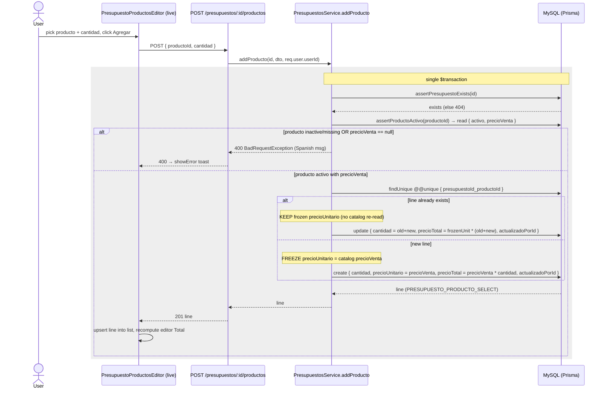

# Design: Presupuestos CRUD (Create, List, Update)

## Technical Approach

Two precedents are copied rather than a third invented (proposal Approach + D8):

- **Header** (`Presupuesto` model, module layout, controller routes, DTO style, `activo` soft-disable, dual audit, `findAll` pagination) mirrors `server/src/productos/` + the `Cliente` dual-audit pair (`server/prisma/schema.prisma:51-67`).
- **Line items** (`PresupuestoProducto`, freeze-price-on-add, sum-on-duplicate via `@@unique`, recompute stored `precioTotal`, add/update/remove trio) mirror `OrdenTrabajoTipoServicioProducto` (`server/prisma/schema.prisma:274-289`) and `ordenes-trabajo.service.ts:702-785` **verbatim**.

One additive Prisma migration adds the two tables. All routes are guarded by `JwtAuthGuard` only (no role guard — deferred to Permisos). The line-item hierarchy is **one level shallower** than `OrdenTrabajo`: OT nests lines under a `detalle` join (`OrdenTrabajoTipoServicio`), so its routes are `.../:id/detalles/:detalleId/productos/:lineaId`. A presupuesto has no such join — lines hang directly off the presupuesto, so routes are `/presupuestos/:id/productos/:detalleId`. Every belongs-to check and cascade is re-derived for that flatter shape; the freeze/sum/recompute arithmetic is unchanged.

The frontend mirrors the `productos/` page-based CRUD shape (list + `nuevo` + `editar/[id]`), reuses `clienteSelectConfig` + `SearchableSelect` for the cliente picker, reuses `listServiceTypes` (`client/app/lib/service-types.ts`) for the tipo-servicio picker, and **duplicates** (D7) the `ordenes-trabajo` product-picker/line-item UI into a presupuestos-local `PresupuestoProductosEditor.tsx`.

## Resolution of the proposal's open risks

### R1 — `Producto.precioVenta` is nullable (verified `server/prisma/schema.prisma:176` → `precioVenta Decimal? @db.Decimal(10, 2)`)

The OT precedent is **`assertProductoActivo`** (`ordenes-trabajo.service.ts:275-290`), invoked by `addDetalleProducto` at line 710. Its exact behavior for a null `precioVenta`:

```ts
if (!producto || !producto.activo) {
  throw new BadRequestException('El producto no existe o está inactivo.');
}
if (producto.precioVenta == null) {
  throw new BadRequestException('El producto no tiene un precio de venta definido.');
}
return { precioVenta: producto.precioVenta };
```

**It REJECTS.** A product with `precioVenta == null` cannot be added to a line — the add fails with HTTP 400 and the Spanish message `'El producto no tiene un precio de venta definido.'`. It does **not** default to `0` and does **not** silently skip.

**Mandate for `presupuestos`:** `PresupuestoProducto`'s add-line-item path (both the `POST /presupuestos/:id/productos` sub-route and each item of the initial `productos[]` in `POST /presupuestos`) MUST call a byte-for-byte copy of `assertProductoActivo` — same two guards, same two `BadRequestException` messages, same `{ precioVenta }` return — before freezing `precioUnitario`. No new behavior, no new message wording. This is the single non-negotiable mirroring point flagged by the proposal Known-Gaps.

### R2 — Exact Prisma schema, `onDelete` policies, relation-name collisions

**Collision check performed** against the full `User` back-relation block (`server/prisma/schema.prisma:22-46`) and every `@relation("...")` in the schema: **no** relation named `PresupuestoCreadoPor`, `PresupuestoActualizadoPor`, or `PresupuestoProductoActualizadoPor` exists. The three proposed names are free and are **ratified** as-is.

**`onDelete` policies — ratified with rationale:**

| Relation | Policy | Rationale |
|----------|--------|-----------|
| `Presupuesto.cliente` → `Cliente` | `Restrict` | A customer with quotes must not be silently orphaned. Note: this is a **stricter** policy than `OrdenTrabajo.cliente` (`schema.prisma:226`), which declares **no** `onDelete` (Prisma default `Restrict` for a required relation — same net effect). Declaring `Restrict` explicitly documents intent. Ratified per proposal. |
| `Presupuesto.tipoServicio` → `TipoServicio` | `Restrict` | Same reasoning; a referenced tipo de servicio can't be deleted out from under a quote. Explicit for intent; matches OT's implicit default. Ratified. |
| `Presupuesto.creadoPor` / `Presupuesto.actualizadoPor` → `User` | `SetNull` | Both FKs nullable; deleting the staff user nulls the audit stamp without deleting the quote — the `Cliente` dual-audit shape (`schema.prisma:60,62`). Ratified. |
| `PresupuestoProducto.presupuesto` → `Presupuesto` | `Cascade` | Deleting a presupuesto row removes its lines. The presupuesto is never hard-deleted in this change (only `activo:false`), so this fires only on a manual DB delete / rollback — mirrors `OrdenTrabajoTipoServicioProducto.ordenTrabajoTipoServicio` (`schema.prisma:277`). Ratified. |
| `PresupuestoProducto.producto` → `Producto` | none (default `Restrict`) | A product referenced by a line can't be deleted; mirrors `OrdenTrabajoTipoServicioProducto.producto` (`schema.prisma:279`, no `onDelete`). Ratified. |
| `PresupuestoProducto.actualizadoPor` → `User` | `SetNull` | Nullable audit FK; mirrors `schema.prisma:284`. Ratified. |

### R3 / R4 / R5

Resolved in the sections below (API surface, Frontend, Sequence Diagram).

## Data Model

### Prisma schema diff (`server/prisma/schema.prisma`)

Append two models (mirroring `Producto`'s dual-audit header shape and `OrdenTrabajoTipoServicioProducto`'s line shape):

```prisma
model Presupuesto {
  id               Int                   @id @default(autoincrement())
  fecha            DateTime
  clienteId        Int
  cliente          Cliente               @relation(fields: [clienteId], references: [id], onDelete: Restrict)
  tipoServicioId   Int
  tipoServicio     TipoServicio          @relation(fields: [tipoServicioId], references: [id], onDelete: Restrict)
  telefono         String?
  descripcion      String?
  activo           Boolean               @default(true)
  creadoPorId      Int?
  creadoPor        User?                 @relation("PresupuestoCreadoPor", fields: [creadoPorId], references: [id], onDelete: SetNull)
  actualizadoPorId Int?
  actualizadoPor   User?                 @relation("PresupuestoActualizadoPor", fields: [actualizadoPorId], references: [id], onDelete: SetNull)
  productos        PresupuestoProducto[]
  createdAt        DateTime              @default(now())
  updatedAt        DateTime              @updatedAt
}

model PresupuestoProducto {
  id               Int         @id @default(autoincrement())
  presupuestoId    Int
  presupuesto      Presupuesto @relation(fields: [presupuestoId], references: [id], onDelete: Cascade)
  productoId       Int
  producto         Producto    @relation(fields: [productoId], references: [id])
  cantidad         Decimal     @db.Decimal(10, 2)
  precioUnitario   Decimal     @db.Decimal(10, 2)
  precioTotal      Decimal     @db.Decimal(10, 2)
  actualizadoPorId Int?
  actualizadoPor   User?       @relation("PresupuestoProductoActualizadoPor", fields: [actualizadoPorId], references: [id], onDelete: SetNull)
  createdAt        DateTime    @default(now())
  updatedAt        DateTime    @updatedAt

  @@unique([presupuestoId, productoId])
}
```

Back-relations added to existing models (append to each model's relation block):

```prisma
// model User (alongside clientesCreados / productosCreados etc.)
  presupuestosCreados              Presupuesto[]         @relation("PresupuestoCreadoPor")
  presupuestosActualizados         Presupuesto[]         @relation("PresupuestoActualizadoPor")
  presupuestoProductosActualizados PresupuestoProducto[] @relation("PresupuestoProductoActualizadoPor")

// model Cliente (alongside vehiculos / ordenesTrabajo)
  presupuestos       Presupuesto[]

// model TipoServicio (alongside detalles)
  presupuestos     Presupuesto[]

// model Producto (alongside ordenTrabajoTipoServicioProductos)
  presupuestoProductos PresupuestoProducto[]
```

The compound `@@unique([presupuestoId, productoId])` generates the Prisma nested-unique input key **`presupuestoId_productoId`**, used by the sum-on-duplicate `findUnique` (see service). Migration is additive-only (two new tables + FKs), reversible per the proposal Rollback Plan. `sdd-apply` MUST confirm `DATABASE_URL` before `prisma migrate` (proposal Known-Gap).

## Backend Module Structure

`server/src/presupuestos/` mirrors `server/src/productos/`:

| File | Contents |
|------|----------|
| `presupuestos.module.ts` | `@Module({ controllers: [PresupuestosController], providers: [PresupuestosService] })` → `export class PresupuestosModule {}` |
| `presupuestos.controller.ts` | `@Controller('presupuestos')`, class-level `@UseGuards(JwtAuthGuard)`; header routes `GET /`, `GET /:id`, `POST /`, `PATCH /:id` + line-item sub-routes |
| `presupuestos.service.ts` | `findAll`, `findOne`, `create`, `update`, `addProducto`, `updateProducto`, `removeProducto`; owns all Prisma; private `assertClienteActivo`, `assertTipoServicioActivo`, `assertProductoActivo`, `assertPresupuestoExists`, `loadLinea` |
| `dto/create-presupuesto.dto.ts` | `CreatePresupuestoDto` (+ nested optional `productos`) |
| `dto/update-presupuesto.dto.ts` | `UpdatePresupuestoDto` (full body, no `productos`) |
| `dto/list-presupuestos-query.dto.ts` | `ListPresupuestosQueryDto` + `PresupuestoStatusFilter` type |
| `dto/create-presupuesto-producto.dto.ts` | `CreatePresupuestoProductoDto` (line-item add/update body) |

### DTOs (every field explicit — global `whitelist: true` strips unknowns; audit FKs are NEVER in any DTO)

```ts
// create-presupuesto-producto.dto.ts — mirrors create-orden-trabajo-producto.dto.ts verbatim
import { IsInt, IsNumber, Max, Min } from 'class-validator';

export class CreatePresupuestoProductoDto {
  @IsInt()
  productoId: number;

  @IsNumber({ maxDecimalPlaces: 2 })
  @Min(0.01)
  @Max(99999999.99)
  cantidad: number;
}
```

```ts
// create-presupuesto.dto.ts
import { Type } from 'class-transformer';
import {
  IsArray, IsInt, IsISO8601, IsOptional, IsString, ValidateNested,
} from 'class-validator';
import { CreatePresupuestoProductoDto } from './create-presupuesto-producto.dto';

export class CreatePresupuestoDto {
  // Quote's own date, set by the user (distinct from createdAt). JSON payload
  // is an ISO string; the service wraps it with `new Date(dto.fecha)`.
  @IsISO8601()
  fecha: string;

  @IsInt()
  clienteId: number;

  @IsInt()
  tipoServicioId: number;

  @IsOptional()
  @IsString()
  telefono?: string;

  @IsOptional()
  @IsString()
  descripcion?: string;

  // NO `activo` field: the spec mandates `activo` defaults to `true` and is
  // NOT client-settable on create. Mirrors CreateProductoDto (no `activo`) —
  // the Prisma schema `@default(true)` is the sole authority on create.

  // Optional initial line items — each frozen server-side at POST time.
  @IsOptional()
  @IsArray()
  @ValidateNested({ each: true })
  @Type(() => CreatePresupuestoProductoDto)
  productos?: CreatePresupuestoProductoDto[];
}
```

```ts
// update-presupuesto.dto.ts — FULL body (D5), NO productos (lines edited via sub-routes)
import { IsBoolean, IsInt, IsISO8601, IsOptional, IsString } from 'class-validator';

export class UpdatePresupuestoDto {
  @IsISO8601()
  fecha: string;

  @IsInt()
  clienteId: number;

  @IsInt()
  tipoServicioId: number;

  @IsOptional()
  @IsString()
  telefono?: string;

  @IsOptional()
  @IsString()
  descripcion?: string;

  @IsOptional()
  @IsBoolean()
  activo?: boolean;
}
```

```ts
// list-presupuestos-query.dto.ts — mirrors list-productos-query.dto.ts
import { Type } from 'class-transformer';
import { IsIn, IsInt, IsOptional, IsString, Max, Min } from 'class-validator';

export type PresupuestoStatusFilter = 'all' | 'activo' | 'inactivo';

export class ListPresupuestosQueryDto {
  @IsOptional() @Type(() => Number) @IsInt() @Min(1)
  page?: number = 1;

  @IsOptional() @Type(() => Number) @IsInt() @Min(1) @Max(100)
  pageSize?: number = 10;

  @IsOptional() @IsString()
  search?: string;

  @IsOptional() @IsIn(['all', 'activo', 'inactivo'])
  status?: PresupuestoStatusFilter = 'all';
}
```

> The line-item sub-routes (add + update) both accept `CreatePresupuestoProductoDto`. OT reuses a separate `UpdateOrdenTrabajoProductoDto` for its PATCH; here the update body is identical (only `cantidad` is writable — `productoId` on PATCH is ignored/irrelevant because the line is addressed by `:detalleId`), so a single DTO is sufficient. Documented as a minor divergence, not a behavior change.

### Controller (`presupuestos.controller.ts`)

`@Controller('presupuestos')` + class-level `@UseGuards(JwtAuthGuard)`. Header routes mirror `productos.controller.ts`; line-item sub-routes mirror `ordenes-trabajo.controller.ts:74-103` collapsed to a single nesting level. Route order: `GET /` and `POST /` before `:id`; the sub-routes are literal-suffixed so no `:id`-capture hazard exists.

```ts
@Get()
async findAll(@Query() query: ListPresupuestosQueryDto) {
  return this.presupuestosService.findAll(query);
}

@Get(':id')
async findOne(@Param('id', ParseIntPipe) id: number) {
  return this.presupuestosService.findOne(id);
}

@Post()
async create(
  @Body() dto: CreatePresupuestoDto,
  @Request() req: { user: { userId: number; username: string } },
) {
  return this.presupuestosService.create(dto, req.user.userId);
}

@Patch(':id')
async update(
  @Param('id', ParseIntPipe) id: number,
  @Body() dto: UpdatePresupuestoDto,
  @Request() req: { user: { userId: number; username: string } },
) {
  return this.presupuestosService.update(id, dto, req.user.userId);
}

// ---- Line-item sub-routes (flattened OT trio; no :detalleId join level) ----

@Post(':id/productos')
async addProducto(
  @Param('id', ParseIntPipe) id: number,
  @Body() dto: CreatePresupuestoProductoDto,
  @Request() req: { user: { userId: number; username: string } },
) {
  return this.presupuestosService.addProducto(id, dto, req.user.userId);
}

@Patch(':id/productos/:detalleId')
async updateProducto(
  @Param('id', ParseIntPipe) id: number,
  @Param('detalleId', ParseIntPipe) detalleId: number,
  @Body() dto: CreatePresupuestoProductoDto,
  @Request() req: { user: { userId: number; username: string } },
) {
  return this.presupuestosService.updateProducto(id, detalleId, dto, req.user.userId);
}

@Delete(':id/productos/:detalleId')
@HttpCode(204)
async removeProducto(
  @Param('id', ParseIntPipe) id: number,
  @Param('detalleId', ParseIntPipe) detalleId: number,
) {
  return this.presupuestosService.removeProducto(id, detalleId);
}
```

> **No `DELETE /presupuestos/:id`** (D3). The only delete-shaped route removes a *line item*, mirroring `removeDetalleProducto` — no `actualizadoPorId` param (the row is gone, nowhere to stamp it; OT precedent at `ordenes-trabajo.service.ts:778-785`).

### Service (`presupuestos.service.ts`)

**SELECT whitelists** — the header projects `creadoPor`/`actualizadoPor` with the **slim `{ id, username }`** shape (this module mirrors `productos`, whose `PRODUCTO_SELECT` uses `{ id, username }` at `productos.service.ts:31-32`, not the four-field `colors` shape). The line SELECT mirrors `ORDEN_TRABAJO_PRODUCTO_SELECT` (`ordenes-trabajo.service.ts:53-60`).

```ts
const PRESUPUESTO_PRODUCTO_SELECT = {
  id: true,
  cantidad: true,
  precioUnitario: true,
  precioTotal: true,
  producto: { select: { id: true, descripcion: true } },
  updatedAt: true,
};

const PRESUPUESTO_SELECT = {
  id: true,
  fecha: true,
  telefono: true,
  descripcion: true,
  activo: true,
  createdAt: true,
  updatedAt: true,
  cliente: { select: { id: true, razonSocial: true } },
  tipoServicio: { select: { id: true, descripcion: true } },
  creadoPor: { select: { id: true, username: true } },
  actualizadoPor: { select: { id: true, username: true } },
  productos: { select: PRESUPUESTO_PRODUCTO_SELECT, orderBy: { id: 'asc' } },
};
```

**Filter helper** — `buildPresupuestoWhere` mirrors `buildProductoWhere` (`productos.service.ts:53-72`), returning `{ searchWhere, where }`. Search spans the quote's own text fields plus the related customer name (the most useful lookups for a quote list):

```ts
const term = filter.search?.trim();
const searchWhere: Prisma.PresupuestoWhereInput = term
  ? {
      OR: [
        { descripcion: { contains: term } },
        { telefono: { contains: term } },
        { cliente: { razonSocial: { contains: term } } },
      ],
    }
  : {};
// where = { ...searchWhere, ...(status === 'activo' ? { activo: true } : status === 'inactivo' ? { activo: false } : {}) }
```
Keep the MySQL "`mode: 'insensitive'` unsupported, collation handles case" comment from the productos/colors precedent.

**Private guards** (all mirror OT/productos precedents; messages Spanish):

| Helper | Behavior |
|--------|----------|
| `assertClienteActivo(clienteId)` | `findUnique({ where: { id }, select: { activo: true } })`; if `!cliente \|\| !cliente.activo` → `BadRequestException('El cliente no existe o está inactivo.')`. Pattern from `assertProductoActivo`. |
| `assertTipoServicioActivo(tipoServicioId)` | Same shape → `BadRequestException('El tipo de servicio no existe o está inactivo.')`. |
| `assertProductoActivo(client, productoId)` | **Byte-for-byte copy of `ordenes-trabajo.service.ts:275-290`** (see R1): rejects inactive/missing AND rejects null `precioVenta` with `'El producto no tiene un precio de venta definido.'`; returns `{ precioVenta: Prisma.Decimal }`. Accepts a `tx` client so it runs inside the add transaction. |
| `assertPresupuestoExists(client, presupuestoId)` | `findUnique({ where: { id }, select: { id: true } })`; if null → `NotFoundException('Presupuesto no encontrado.')`. Replaces OT's `loadDetalleParaProducto`; there is **no** estado/`terminado` gate (D3 — presupuestos have no lifecycle), so no `ConflictException` branch. |
| `loadLinea(client, presupuestoId, detalleId)` | `findUnique({ where: { id: detalleId }, select: { id, presupuestoId, cantidad, precioUnitario } })`; if `!linea \|\| linea.presupuestoId !== presupuestoId` → `NotFoundException('Línea de producto no encontrada.')`. Mirrors `ordenes-trabajo.service.ts:257-270`, retargeted from `detalleId` to `presupuestoId`. |

**Methods** (`@Injectable()`, `constructor(private readonly prisma: PrismaService) {}`):

| Method | Signature | Behavior |
|--------|-----------|----------|
| `findAll` | `findAll(query: ListPresupuestosQueryDto)` | `page ?? 1`, `pageSize ?? 10`, `buildPresupuestoWhere(query)`; `$transaction([findMany({ where, select: PRESUPUESTO_SELECT, orderBy: { id: 'asc' }, skip, take }), count({ where }), count({ where: { ...searchWhere, activo: true } })])`; returns `{ data, total, activeCount }`. Verbatim from `productos.findAll`. |
| `findOne` | `findOne(id: number)` | `findUnique({ where: { id }, select: PRESUPUESTO_SELECT })`; if null → `NotFoundException('Presupuesto no encontrado.')`. Includes `productos`. |
| `create` | `create(dto, creadoPorId: number)` | Validate `assertClienteActivo` + `assertTipoServicioActivo`. Then a single `$transaction(async tx => …)`: (1) create header `{ fecha: new Date(dto.fecha), clienteId, tipoServicioId, telefono, descripcion, creadoPorId, actualizadoPorId: creadoPorId }` (NO `activo` in the data block — the Prisma schema `@default(true)` sets it, mirroring `ProductosService.create` which never writes `activo`) → new id; (2) for each item in `dto.productos ?? []`, run the same freeze+sum-on-duplicate logic as `addProducto` (assert active, `findUnique` compound, sum-or-create, stamp `actualizadoPorId: creadoPorId`) — this correctly handles the same `productoId` appearing twice in the input array; (3) return `tx.presupuesto.findUnique({ where: { id }, select: PRESUPUESTO_SELECT })`. **Stamps both audit FKs from the caller** (like `productos.create`). |
| `update` | `update(id, dto, actualizadoPorId: number)` | `assertPresupuestoExists`; `assertClienteActivo` + `assertTipoServicioActivo` (re-validated on every update, since the full body always carries both — same unconditional-recheck stance as `productos.update` for `unidadMedidaId`). `update({ where: { id }, data: { fecha: new Date(dto.fecha), clienteId, tipoServicioId, telefono, descripcion, activo: dto.activo, actualizadoPorId }, select: PRESUPUESTO_SELECT })`. **Does NOT touch `productos`** — line items are managed only via the sub-routes. |
| `addProducto` | `addProducto(presupuestoId, dto, actualizadoPorId)` | `$transaction`: `assertPresupuestoExists(tx, presupuestoId)`; `const { precioVenta } = await assertProductoActivo(tx, dto.productoId)`; `cantidad = new Prisma.Decimal(dto.cantidad)`; `findUnique({ where: { presupuestoId_productoId: { presupuestoId, productoId: dto.productoId } }, select: { id, cantidad, precioUnitario } })`. **If existing** → sum: `nuevaCantidad = existing.cantidad.plus(cantidad)`, `update({ data: { cantidad: nuevaCantidad, precioTotal: existing.precioUnitario.times(nuevaCantidad), actualizadoPorId }, select: PRESUPUESTO_PRODUCTO_SELECT })` — keeps the FROZEN `precioUnitario`, does NOT re-read the catalog. **Else** → freeze: `create({ data: { presupuestoId, productoId, cantidad, precioUnitario: precioVenta, precioTotal: precioVenta.times(cantidad), actualizadoPorId }, select: PRESUPUESTO_PRODUCTO_SELECT })`. Mirrors `addDetalleProducto` (`ordenes-trabajo.service.ts:702-751`) exactly. |
| `updateProducto` | `updateProducto(presupuestoId, detalleId, dto, actualizadoPorId)` | `$transaction`: `assertPresupuestoExists`; `linea = loadLinea(tx, presupuestoId, detalleId)`; `cantidad = new Prisma.Decimal(dto.cantidad)`; `update({ where: { id: detalleId }, data: { cantidad, precioTotal: linea.precioUnitario.times(cantidad), actualizadoPorId }, select: PRESUPUESTO_PRODUCTO_SELECT })` — recompute from the FROZEN `precioUnitario`, catalog never re-read. Mirrors `updateDetalleProducto` (`:753-776`). |
| `removeProducto` | `removeProducto(presupuestoId, detalleId)` | `$transaction`: `assertPresupuestoExists`; `loadLinea`; `delete({ where: { id: detalleId } })`. No `actualizadoPorId` (row is gone). Mirrors `removeDetalleProducto` (`:778-785`). |

`create` never writes `activo` (schema `@default(true)` is authoritative — spec-mandated, matching `ProductosService.create`). `update` passes `dto.activo` straight through (Prisma leaves the column untouched when `undefined`), matching `productos.update`.

## Module Registration

`server/src/app.module.ts` — add import and register in `imports`:

```ts
import { PresupuestosModule } from './presupuestos/presupuestos.module';
// imports: [ ..., ProductosModule, OrdenesTrabajoModule, PresupuestosModule ]
```

## Frontend

### `client/app/lib/presupuestos.ts` (mirror of `lib/productos.ts`)

```ts
export interface PresupuestoProductoLinea {
  id: number;
  cantidad: string;        // Decimal serialized as string by Prisma/JSON
  precioUnitario: string;
  precioTotal: string;
  producto: { id: number; descripcion: string };
  updatedAt: string;
}

export interface PresupuestoListItem {
  id: number;
  fecha: string;
  telefono: string | null;
  descripcion: string | null;
  activo: boolean;
  createdAt: string;
  updatedAt: string;
  cliente: { id: number; razonSocial: string };
  tipoServicio: { id: number; descripcion: string };
  creadoPor: { id: number; username: string } | null;
  actualizadoPor: { id: number; username: string } | null;
  productos: PresupuestoProductoLinea[];
}

export interface CreatePresupuestoProductoPayload { productoId: number; cantidad: number; }
export interface CreatePresupuestoPayload {
  fecha: string; clienteId: number; tipoServicioId: number;
  telefono?: string; descripcion?: string; activo?: boolean;
  productos?: CreatePresupuestoProductoPayload[];
}
export interface UpdatePresupuestoPayload {
  fecha: string; clienteId: number; tipoServicioId: number;
  telefono?: string; descripcion?: string; activo?: boolean;
}
```

Copy `handleJsonResponse<T>`, `ListPresupuestosParams` (`page`, `pageSize`, `search?`, `status?`), `PaginatedPresupuestos` (`{ data: PresupuestoListItem[]; total: number; activeCount: number }`) from productos. Functions, each spreading `getAuthHeader()` (+ `Content-Type` on mutations):

| Function | Signature | Endpoint |
|----------|-----------|----------|
| `listPresupuestos` | `(params): Promise<PaginatedPresupuestos>` | `GET /presupuestos?…` |
| `getPresupuesto` | `(id): Promise<PresupuestoListItem>` | `GET /presupuestos/${id}` |
| `createPresupuesto` | `(data: CreatePresupuestoPayload): Promise<PresupuestoListItem>` | `POST /presupuestos` |
| `updatePresupuesto` | `(id, data: UpdatePresupuestoPayload): Promise<PresupuestoListItem>` | `PATCH /presupuestos/${id}` |
| `addPresupuestoProducto` | `(id, data: CreatePresupuestoProductoPayload): Promise<PresupuestoProductoLinea>` | `POST /presupuestos/${id}/productos` |
| `updatePresupuestoProducto` | `(id, detalleId, data): Promise<PresupuestoProductoLinea>` | `PATCH /presupuestos/${id}/productos/${detalleId}` |
| `removePresupuestoProducto` | `(id, detalleId): Promise<void>` | `DELETE /presupuestos/${id}/productos/${detalleId}` |

### Pages under `client/app/(dashboard)/presupuestos/`

| File | Mirrors | Contents |
|------|---------|----------|
| `page.tsx` | `productos/page.tsx` list shape (D6: simple table, search + `activo` filter, **no** card/table toggle) | `'use client'`; table columns `#`, `Fecha`, `Cliente`, `Tipo de servicio`, `Total`, `Estado`, `Acciones` (edit + activate/deactivate via `updatePresupuesto`). 350ms search debounce, status filter, pagination — copied from the productos/colores list. `Total` = client-side sum of `productos[].precioTotal`. |
| `nuevo/page.tsx` | `productos/nuevo` (page-based create) | Header form (cliente picker + tipo-servicio picker + `fecha` + `telefono` + `descripcion`) and `<PresupuestoProductosEditor mode="staged" …>`. On submit → `createPresupuesto({ ...header, productos: staged })` → redirect to list (or `editar/[id]`). |
| `editar/[id]/page.tsx` | `productos/editar/[id]` (page-based edit) | Loads via `getPresupuesto(id)`. Header PATCH via `updatePresupuesto`. `<PresupuestoProductosEditor mode="live" presupuestoId={id} …>` wired to the live sub-route client fns. |
| `PresupuestoProductosEditor.tsx` | **Duplicated** from `ordenes-trabajo/[id]/trabajo/page.tsx:265-720` (D7) | The `ProductoPicker` combobox (portaled panel, 350ms debounce, keyboard nav — copied lines 265-460) + the line-item list UI (copied lines 642-720: descripcion, editable `cantidad` input, `$ c/u`, `$ total`, Actualizar/Quitar buttons). |

**Cliente picker**: `clienteSelectConfig` (`vehiculos/referenceSelectConfigs.tsx:80-137`) + `SearchableSelect` (`vehiculos/SearchableSelect.tsx`), as-is.
**Tipo-servicio picker**: add a `tipoServicioSelectConfig` to `referenceSelectConfigs.tsx` (search-only, no quickCreate), backed by `listServiceTypes` from `client/app/lib/service-types.ts` (`{ status: 'activo', page: 1, pageSize: 20 }` → `{ id, label: descripcion }`), used with the same `SearchableSelect`. No new backend needed — `service-types` already exists.
**Product combobox**: uses the already-generic `searchProductos` (`client/app/lib/productos.ts:150-158`).

### `client/app/lib/navigation.tsx`

Add one flat entry after `Productos` (matching the `NavigationItem` shape used by Clientes/Productos; reuse an existing icon asset rather than ship a broken image, per the tipos-servicio precedent):

```tsx
{
  name: 'Presupuestos',
  href: '/presupuestos',
  id: 'presupuestos',
  icon: ,
},
```

## Architecture Decisions

### Decision A1: Create stages line items client-side; edit manages them live (the key create-vs-edit split)

**Context**: `OrdenTrabajo`'s trabajo page always operates on an already-persisted `detalle`, so it can add/update/remove lines against the server immediately. A presupuesto being *created* has no id yet — its lines can't hit a `/:id/productos` sub-route.

**Choice**: one presentational `PresupuestoProductosEditor` driven by injected async handlers (`onAdd`, `onUpdate`, `onRemove`), used in two modes:
- **`nuevo` (staged mode)** — handlers mutate an in-memory array; on header submit the whole array is sent as `POST /presupuestos { …, productos: [...] }` and the **server** freezes each price authoritatively (matching R1). To show accurate frozen prices *before* save, the staged `onAdd` fetches the product's `precioVenta` via `getProducto(productoId)` (`client/app/lib/productos.ts`) and previews `precioUnitario`/`precioTotal`; this preview is display-only and is re-frozen server-side on POST.
- **`editar` (live mode)** — handlers call `addPresupuestoProducto`/`updatePresupuestoProducto`/`removePresupuestoProducto` and use the server's returned line, exactly like the OT trabajo page.

**Alternatives**: (a) create header-only, then force a redirect to `editar/[id]` to add lines — rejected: contradicts the proposal's explicit "optional initial `productos[]` in `POST`" and Success Criteria, and worsens UX. (b) Two separate editor components — rejected: doubles the D7 duplication surface.

**Rationale**: keeps a single duplicated editor (honoring D7's "don't extract yet" while not multiplying copies), satisfies the POST-with-initial-lines contract, and keeps the server the sole authority on frozen prices. The client preview never becomes the stored price.

### Decision A2: Flatten the OT line-item route hierarchy by one level

**Choice**: `/presupuestos/:id/productos/:detalleId` instead of OT's `/…/:id/detalles/:detalleId/productos/:lineaId`.
**Rationale**: OT's extra `detalle` level exists because lines belong to an `OrdenTrabajoTipoServicio` join (M2M tipos). A presupuesto has a single tipo de servicio (D2) and lines belong directly to it — a `detalle` level would be dead structure. `loadLinea` re-targets its belongs-to check from `detalleId` to `presupuestoId`; all arithmetic is unchanged. `:detalleId` names the `PresupuestoProducto.id`.

### Decision A3: Reject null `precioVenta` by mirroring `assertProductoActivo` verbatim (resolves R1)

**Choice**: copy the OT guard byte-for-byte — HTTP 400 `'El producto no tiene un precio de venta definido.'`.
**Alternatives**: default to `0` (silently stores a meaningless line), or skip the product (silently drops user intent). Both rejected.
**Rationale**: the proposal mandates mirroring OT precedent "byte-for-byte in this respect"; the precedent rejects. A zero-priced or dropped line would corrupt the quote total silently — the exact failure the freeze design exists to prevent.

### Decision A4: `Restrict` on `cliente`/`tipoServicio`, ratified (resolves R2)

**Choice**: explicit `onDelete: Restrict` on both required FKs (net-identical to OT's implicit Prisma default for required relations, but declared for intent), `SetNull` on all audit FKs, `Cascade` on `PresupuestoProducto.presupuesto`.
**Rationale**: a customer or tipo de servicio referenced by a quote must not be silently orphaned (proposal risk row); audit FKs must survive user deletion; lines cascade only on a real parent delete (which this change never issues — soft-deactivate only).

### Decision A5: Single line-item DTO for add + update

**Choice**: both sub-routes accept `CreatePresupuestoProductoDto`; PATCH ignores `productoId` (line addressed by `:detalleId`).
**Rationale**: only `cantidad` is writable on update; a dedicated `UpdatePresupuestoProductoDto` would be a one-field clone. Minor divergence from OT's two-DTO split, no behavior change.

### Decision A6: `JwtAuthGuard` only, no role guard

**Choice**: class-level `@UseGuards(JwtAuthGuard)`, no `RolesGuard`.
**Rationale**: consistent with every existing section; access control deferred to the future Permisos feature. No `RolesGuard` exists in the codebase. (Accepted gap, per proposal.)

## Sequence Diagram — add a product line item to a presupuesto

The one non-trivial business rule: freeze price on first add, sum-on-duplicate via `@@unique`, recompute stored `precioTotal`, reject null `precioVenta`. Shown for the **live/edit** path; the **create/staged** path runs the identical service logic inside `create()`'s transaction, once per `productos[]` item.



## Data Flow

    /presupuestos (list) ──listPresupuestos()──▶ GET /presupuestos ──JwtAuthGuard──▶ findAll ──▶ Prisma ($transaction: data + total + activeCount)
        │  Nuevo (page)
        ├─ header form + PresupuestoProductosEditor[staged] ──createPresupuesto({…, productos[]})──▶ POST /presupuestos
        │        └──▶ create(dto, userId): assert cliente/tipoServicio activo → $tx{ create header (creadoPorId+actualizadoPorId) → per item: assertProductoActivo + freeze/sum } → full presupuesto
        │  Editar (page)  ──getPresupuesto(id)──▶ GET /presupuestos/:id
        ├──updatePresupuesto()──▶ PATCH /presupuestos/:id ──▶ update(id, dto, userId): stamps actualizadoPorId (header only)
        └─ PresupuestoProductosEditor[live]
              ├──addPresupuestoProducto()──▶ POST /presupuestos/:id/productos ──▶ addProducto (freeze/sum, see sequence diagram)
              ├──updatePresupuestoProducto()──▶ PATCH /presupuestos/:id/productos/:detalleId ──▶ updateProducto (recompute from frozen unit)
              └──removePresupuestoProducto()──▶ DELETE /presupuestos/:id/productos/:detalleId ──▶ removeProducto (delete line)

## File Changes

| File | Action | Description |
|------|--------|-------------|
| `server/prisma/schema.prisma` | Modify | Add `Presupuesto` + `PresupuestoProducto` models; back-relations on `User` (×3), `Cliente`, `TipoServicio`, `Producto` |
| `server/prisma/migrations/<ts>_add_presupuestos/` | Create | Additive migration (two tables + FKs) |
| `server/src/presupuestos/presupuestos.module.ts` | Create | Module wiring |
| `server/src/presupuestos/presupuestos.controller.ts` | Create | Guarded controller: 4 header routes + 3 line-item sub-routes |
| `server/src/presupuestos/presupuestos.service.ts` | Create | findAll/findOne/create/update + addProducto/updateProducto/removeProducto + private guards |
| `server/src/presupuestos/dto/create-presupuesto.dto.ts` | Create | CreatePresupuestoDto (+ nested productos) |
| `server/src/presupuestos/dto/update-presupuesto.dto.ts` | Create | UpdatePresupuestoDto (full body, no productos) |
| `server/src/presupuestos/dto/list-presupuestos-query.dto.ts` | Create | ListPresupuestosQueryDto + status type |
| `server/src/presupuestos/dto/create-presupuesto-producto.dto.ts` | Create | CreatePresupuestoProductoDto |
| `server/src/app.module.ts` | Modify | Import + register `PresupuestosModule` |
| `client/app/lib/presupuestos.ts` | Create | Typed fetch wrappers (header + line-item) |
| `client/app/(dashboard)/presupuestos/page.tsx` | Create | List + table + search + activo filter |
| `client/app/(dashboard)/presupuestos/nuevo/page.tsx` | Create | Create page (staged editor) |
| `client/app/(dashboard)/presupuestos/editar/[id]/page.tsx` | Create | Edit page (live editor) |
| `client/app/(dashboard)/presupuestos/PresupuestoProductosEditor.tsx` | Create | Duplicated picker + line-item UI (D7) |
| `client/app/(dashboard)/vehiculos/referenceSelectConfigs.tsx` | Modify | Add `tipoServicioSelectConfig` (search-only, via `listServiceTypes`) |
| `client/app/lib/navigation.tsx` | Modify | Add flat "Presupuestos" nav entry |

## Testing Strategy

| Layer | What | Approach |
|-------|------|----------|
| Manual/e2e | 401 without token on all 7 routes; no `DELETE /presupuestos/:id` (405/404); `POST` stamps `creadoPorId`+`actualizadoPorId` from JWT, `PATCH`/line writes stamp `actualizadoPorId`; add product freezes `precioUnitario` from catalog and stores `precioTotal`; re-adding same product **sums** (no dup row) and keeps frozen price; catalog re-pricing after add does NOT change existing line; **adding a product with null `precioVenta` → 400 `'El producto no tiene un precio de venta definido.'`**; `Restrict` blocks deleting a referenced `Cliente`/`TipoServicio`; deleting a `User` nulls the audit FKs; list paginates/filters/searches (cliente name + descripcion + telefono) | Exercise endpoints + pages against reachable DB — **confirm `DATABASE_URL` before migrating** (proposal Known-Gap) |

## Migration / Rollout

One additive migration adds `Presupuesto` and `PresupuestoProducto` (+ their FKs). Reversible: drop `PresupuestoProducto` then `Presupuesto` (nothing else references them). No data backfill — all referenced tables (`Cliente`, `TipoServicio`, `Producto`, `User`) pre-exist and are touched only by additive back-relations.

## Open Questions

- [ ] Confirm the correct MySQL instance is reachable (`DATABASE_URL`) before running the migration in apply (proposal Known-Gap: `.env` unread in prior phases).
- [ ] `nuevo` list-item price preview fetches `getProducto()` per add (Decision A1) — confirm that extra round-trip is acceptable versus a price-less staged list that only shows totals after the POST returns. Server behavior is unaffected either way.
